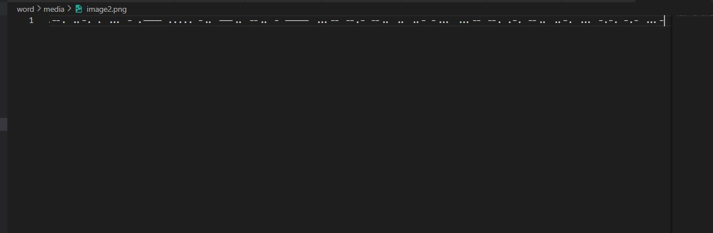

## Challenge Name: morphgura
>Category: Forensic

>Points: 304

>Solves: 35

### Challenge Description: 

Hello, I am gura! i come in many shape and form. nice meeting you all ^^

```Flag format``` : alphanumeric uppercase string with COMPFEST15 prefix
e.g COMPFEST15A1B2C3D4E5F6

Artifact Files:
* [rawr.docx](https://ctf.compfest.id/files/a1eac682f5f2ff1a5e784c9683b79f69/rawr.docx?token=eyJ1c2VyX2lkIjoxMCwidGVhbV9pZCI6bnVsbCwiZmlsZV9pZCI6NH0.ZNCdGA.bHNeVbfrFYqCvLZTKuExtCT2HYM)

### Approach

**1. Analyze the file**

Tidak usah basa basi, langsung unduh aja filenya, atau kalau mau pake commandline bisa dengan command berikut:
```
wget -c https://ctf.compfest.id/files/a1eac682f5f2ff1a5e784c9683b79f69/rawr.docx?token=eyJ1c2VyX2lkIjoxMCwidGVhbV9pZCI6bnVsbCwiZmlsZV9pZCI6NH0.ZNCdGA.bHNeVbfrFYqCvLZTKuExtCT2HYM
```
Jika nama filenya random misal:
```
'rawr.docx?token=eyJ1c2VyX2lkIjoxMCwidGVhbV9pZCI6bnVsbCwiZmlsZV9pZCI6NH0.ZNCdGA.bHNeVbfrFYqCvLZTKuExtCT2HYM'
```
Rename menggunakan ```mv```:
```
mv 'rawr.docx?token=eyJ1c2VyX2lkIjoxMCwidGVhbV9pZCI6bnVsbCwiZmlsZV9pZCI6NH0.ZNCdGA.bHNeVbfrFYqCvLZTKuExtCT2HYM' rawr.docx
```
Sekarang mari kita buka filenya.

Hanya tekd dokumen biasa tentang seorang Vtuber H*lolive EN bernama **Gawr Gura**(~~Sepertinya penulis soal seorang shrimp~~). Sekilas tidak ada yang aneh minus gambar kedua tidak bisa dibuka. Sepertinya ada hubungannya dengan flag.

**2. How to get the flag?**

Karena ini challenge Forensic, maka kita harus suudzon bahwa file _innocent_ ini menyimpan rahasia ~~kelam~~ tersembunyi. Mari kita jalankan **binwalk**.
```
binwalk rawr.docx
```
Diperoleh:
```

DECIMAL       HEXADECIMAL     DESCRIPTION
--------------------------------------------------------------------------------
0             0x0             Zip archive data, at least v2.0 to extract, compressed size: 366, uncompressed size: 1414, name: [Content_Types].xml
935           0x3A7           Zip archive data, at least v2.0 to extract, compressed size: 239, uncompressed size: 590, name: _rels/.rels
1735          0x6C7           Zip archive data, at least v2.0 to extract, compressed size: 2293, uncompressed size: 11144, name: word/document.xml
4075          0xFEB           Zip archive data, at least v2.0 to extract, compressed size: 459, uncompressed size: 2577, name: word/_rels/document.xml.rels
4856          0x12F8          Zip archive data, at least v1.0 to extract, compressed size: 261848, uncompressed size: 261848, name: word/media/image1.png
266755        0x41203         Zip archive data, at least v1.0 to extract, compressed size: 134, uncompressed size: 134, name: word/media/image2.png
266940        0x412BC         Zip archive data, at least v1.0 to extract, compressed size: 112231, uncompressed size: 112231, name: word/media/image3.jpeg
379223        0x5C957         Zip archive data, at least v2.0 to extract, compressed size: 1746, uncompressed size: 8393, name: word/theme/theme1.xml
381020        0x5D05C         Zip archive data, at least v2.0 to extract, compressed size: 1001, uncompressed size: 2652, name: word/settings.xml
382068        0x5D474         Zip archive data, at least v2.0 to extract, compressed size: 3238, uncompressed size: 30630, name: word/styles.xml
385351        0x5E147         Zip archive data, at least v2.0 to extract, compressed size: 451, uncompressed size: 1311, name: word/webSettings.xml
385852        0x5E33C         Zip archive data, at least v2.0 to extract, compressed size: 696, uncompressed size: 2572, name: word/fontTable.xml
386596        0x5E624         Zip archive data, at least v2.0 to extract, compressed size: 379, uncompressed size: 779, name: docProps/core.xml
387286        0x5E8D6         Zip archive data, at least v2.0 to extract, compressed size: 377, uncompressed size: 716, name: docProps/app.xml
388880        0x5EF10         End of Zip archive, footer length: 22
```
Nah kan benar ada file yang dicompress. Mari kita bongkar itu semua.
```
binwalk -e rawr.docx
```
Diperoleh sebuah folder bernama ```_rawr.docx.extracted``` dengan isi berikut:
```
 0.zip  '[Content_Types].xml'   _rels   docProps   word
```
Nah karena isinya banyak dan untuk menghemat waktu, kita mulai dari yang mencurigakan dulu, yakni gambar tadi. Pertama kita coba cari itu gambar dimana. Jika kalian sedang berada di shell berwarna, akan terlihat bahwa ```_rels```,```docProps```,dan ```word``` adalah folder dan file lainnya bukan gambar.

Mari kita cek satu-satu
- Folder ```_rels```
```
```
Kosong.
- Folder ```docProps```
```
app.xml  core.xml
```
Hanya file XML.
- Folder ```word``` 
```
_rels         fontTable.xml  settings.xml  theme
document.xml  media          styles.xml    webSettings.xml
```
Nah ada folder namanya media. Mari kita lihat isinya.
```
image1.png  image2.png  image3.jpeg
```
Nah bener isinya image. Mari kita cari gambar misterus tadi.


Yang 1 sama 3 gambar same-chan tapi yg kedua aneh kenapa gak bisa dibuka. Sepertinya ini gambar misteriusnya. Coba kita buka pake text editor sesuai saran vscode.

Apa ini? bahasa alien apa ini?

Kalau kalian gak skip pramuka harusnya kenal sama ini. Ini sandi morse. Berhubung ku males ngedecode satu-satu, mending kita pake decoder online.

Nah dapet flagnya.
```
COMPFEST15D8ZT03QZIUB3GRZFSCKV
```
### Reflections

Permulaan menarik untuk belajar binwalk dan fakta bahwa .docx itu sebenarnya file zip juga wkwk. Selain itu, refreshing juga dengan materi sandi morse.

---
[Back to home](../Readme.md)
