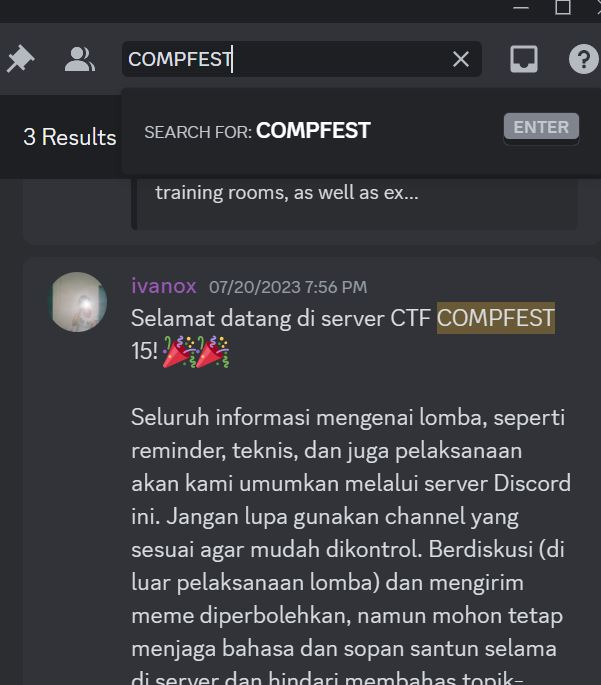
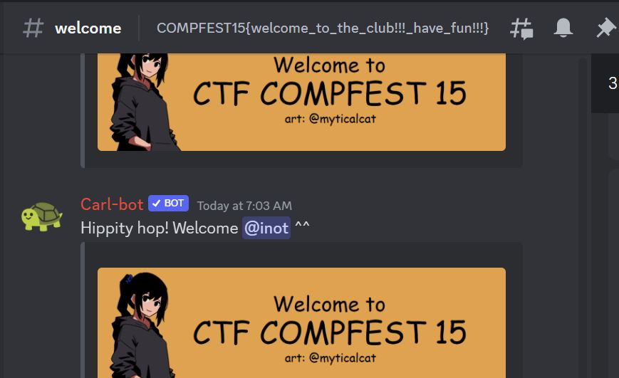

## Challenge Name: welcome
>Category: Misc

>Points: 100

>Solves: 2

### Challenge Description: 

Welcome! You should be able to find the flag somewhere in our Discord server~

Artifact Files:
-

### Approach

**1. How to get the flag?**

Dari deskripsinya mari kita buka Discord. Terus search ```COMPFEST```

Hmm gak ada dong. Apa coba kita cari satu-satu di deskripsi channel/gambar?

Coba mulai dari welcome.

Tunggu ada sesuatu di bannernya macam flag. Sepertinya ini flagnya. Untuk menyalinnya, klik kanan ke teksnya lalu tekan ```Copy Topic```.

Flag:
```
COMPFEST15{welcome_to_the_club!!!_have_fun!!!}
```

### Reflections
Permulaan menarik untuk belajar mencari flag serta belajar fitur di Discord.
  

---
[Back to home](../Readme.md)
