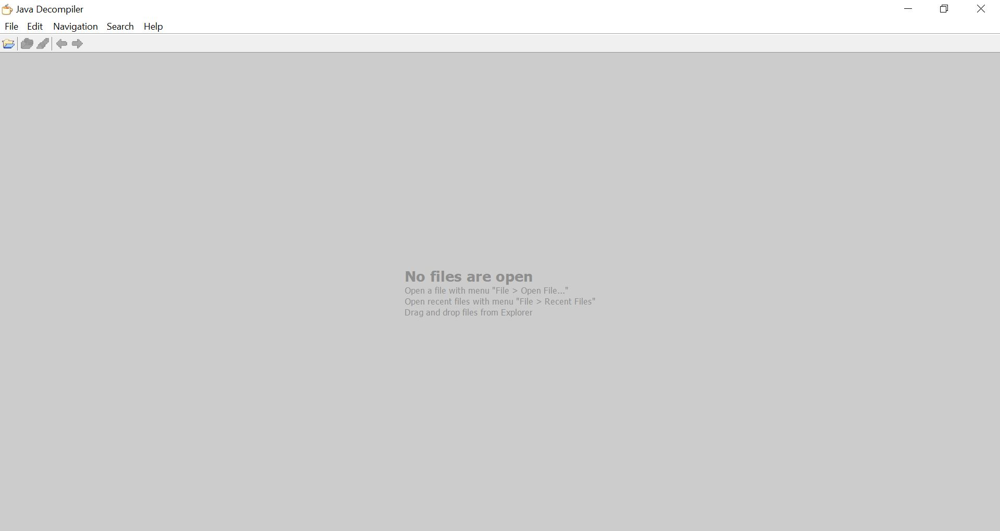
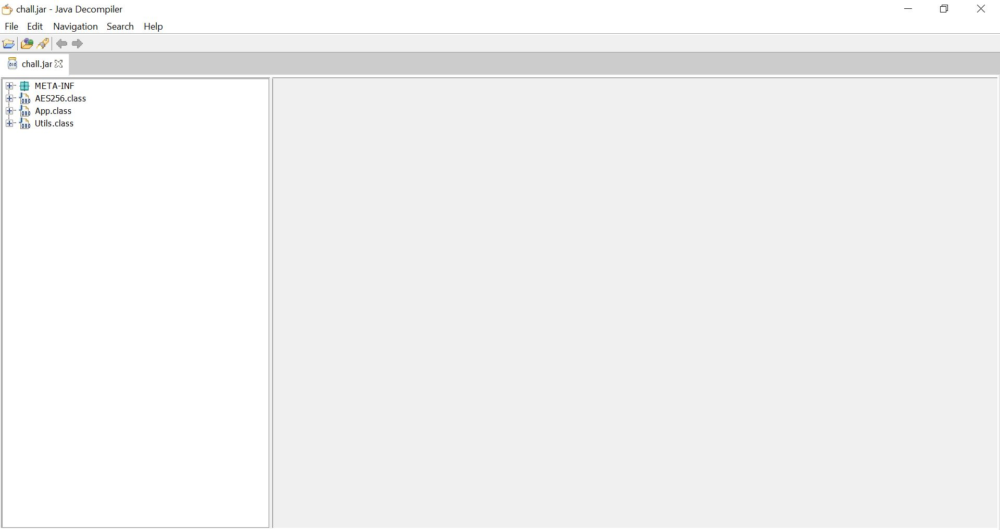

## Challenge Name: 111-1111111
>Category: Reverse Engineering

>Points: 484

>Solves: 10

### Challenge Description: 

Author: rorre

I want to play a favorite game of mine from long ago, Spure, but it requires a license key. I lost it, so can you help me crack it? I swear I bought the game!

Artifact Files:
* [chall.jar](https://ctf.compfest.id/files/d0048c1c2084f43501ac0181ceeef8b8/chall.jar?token=eyJ1c2VyX2lkIjoxMCwidGVhbV9pZCI6bnVsbCwiZmlsZV9pZCI6MjB9.ZN7XiQ.k4AlHm8odB25l6UijwrKcAYrGAU)

### Approach

**1. Analyze ```chall.jar```**

Nostalgia sekali ya, masukin lisence key ke game terus file nya pake ```java```. Okelah lanjut saja ke intinya. Disini, kita hanya diberikan sebuah file ```jar```. Untuk bisa mengerjakan challenge ini, pastikan sudah meng-_install_ [java](https://www.java.com/en/) terlebih dahulu.

Mari kita coba jalankan file ```jar``` ini dengan command:
```
java -jar chall.jar
```
Coba kita jalankan.
```
Hello! Before you can play the game, please enter the license key provided with your CD.

```
Ada prompt dan program menunggu input. Coba kita masukkan acak.
```
grigh38ghi34g034
```
Hasil:
```
Hello! Before you can play the game, please enter the license key provided with your CD.
grigh38ghi34g034
That is not the correct license key.
```
Ternyata program ini menerima input key, memerika key, dan menampilkan hasil. Jika salah menghasilkan prompt, namun ku curiga kalau benar key-nya, bakal dapat flag-nya.

**2. Decompiling ```chall.jar```**

Supaya kita bisa tahu proses verifikasi key, kita perlu melihat instruksi yang dilakukan program. Untungnya ```java``` itu lumayan gampang dikompilasi (dibandingkan ```C``` dan ```C++```). Banyak tool yang bisa melakukan ini dan hasil dekompilasinya lumayan bagus (setidaknya ```java``` masih nyimpan nama variabel-nya, jadi gak perlu ngasih label manual seperti kalau dekompilasi ```C``` atau ```C++```). Salah satu tool yang bisa digunakan adalah [JD Project](http://java-decompiler.github.io/). Padang sesuai release yang dipilih lalu buka aplikasi nya.


Untuk memulai proses dekompilasi, tinggal _drag_ saja file ```chall.jar``` ke layar.

Untuk melihat isi file ```.class``` nya (yang mana merupakan hasil kompilasi tiap file ```.java```), tinggal tekan nama kelas nya di sebelah kiri layar.

Dari sini terlihat, ada 3 buah kelas di file ```.jar``` ini, mari kita decompile satu-per-satu:  
1.  Kelas ```AES256```:
```
import java.nio.charset.StandardCharsets;
import java.util.Base64;
import javax.crypto.Cipher;
import javax.crypto.SecretKey;
import javax.crypto.SecretKeyFactory;
import javax.crypto.spec.IvParameterSpec;
import javax.crypto.spec.PBEKeySpec;
import javax.crypto.spec.SecretKeySpec;

public class AES256 {
  private static final byte[] SALT = "SUPERSECURESALT".getBytes();
  
  private static final IvParameterSpec ivspec;
  
  static {
    byte[] arrayOfByte = "ASDFLKJHIHEFNUCW".getBytes();
    ivspec = new IvParameterSpec(arrayOfByte);
  }
  
  public static String encrypt(String paramString1, String paramString2) {
    try {
      SecretKeyFactory secretKeyFactory = SecretKeyFactory.getInstance("PBKDF2WithHmacSHA256");
      PBEKeySpec pBEKeySpec = new PBEKeySpec(paramString2.toCharArray(), SALT, 65536, 256);
      SecretKey secretKey = secretKeyFactory.generateSecret(pBEKeySpec);
      SecretKeySpec secretKeySpec = new SecretKeySpec(secretKey.getEncoded(), "AES");
      Cipher cipher = Cipher.getInstance("AES/CTR/NoPadding");
      cipher.init(1, secretKeySpec, ivspec);
      return Base64.getEncoder().encodeToString(cipher.doFinal(paramString1.getBytes(StandardCharsets.UTF_8)));
    } catch (Exception exception) {
      System.out.println("Error while encrypting: " + exception.toString());
      return null;
    } 
  }
  
  public static String decrypt(String paramString1, String paramString2) {
    try {
      SecretKeyFactory secretKeyFactory = SecretKeyFactory.getInstance("PBKDF2WithHmacSHA256");
      PBEKeySpec pBEKeySpec = new PBEKeySpec(paramString2.toCharArray(), SALT, 65536, 256);
      SecretKey secretKey = secretKeyFactory.generateSecret(pBEKeySpec);
      SecretKeySpec secretKeySpec = new SecretKeySpec(secretKey.getEncoded(), "AES");
      Cipher cipher = Cipher.getInstance("AES/CTR/NoPadding");
      cipher.init(2, secretKeySpec, ivspec);
      return new String(cipher.doFinal(Base64.getDecoder().decode(paramString1)));
    } catch (Exception exception) {
      System.out.println("Error while decrypting: " + exception.toString());
      return null;
    } 
  }
}

```
Kelas ini berguna untuk melakukan enkripsi dan dekripsi menggunakan ```AES256```. Kelas ini hanya kelas standar untuk algoritma enkripsi dan dekripsi dan kode-nya pun tersedia bebas di internet.  
2. Kelas ```App```:
```
import java.math.BigInteger;
import java.security.NoSuchAlgorithmException;
import java.util.Scanner;

public class App {
  private static String FLAG = "uH/+7rTcTNua8VvQo6aaGlBGs9DPwQl/bGMC2s7xZqddM0klPV1LkIeA5NC3AxHeDg==";
  
  private static int[] values = new int[] { 
      252, 136, 204, 147, 160, 75, 221, 13, 53, 171, 
      113, 140, 103, 120, 95, 192, 145, 181, 155, 75, 
      162, 220, 132, 209, 239, 8, 49, 22, 61, 207, 
      24, 135, 5, 148, 97, 161, 0, 179, 155, 28, 
      12, 142, 194, 169, 230, 138, 138, 176, 194, 104, 
      184, 104, 151, 222, 151, 89, 184, 228, 146, 62, 
      102, 84, 112, 25, 165, 190, 148, 24, 221, 57, 
      149, 235, 128, 153, 25, 223, 76, 180, 167, 188, 
      109, 248, 95, 71, 241, 32, 64, 207, 213, 207, 
      130, 227, 26, 110, 178, 200, 126, 240, 9, 8, 
      78, 193, 227, 18, 121, 108, 135, 112, 234, 64, 
      220, 246, 11, 195, 192, 239, 98, 216, 79, 36, 
      104, 19, 59, 109, 253, 135, 151, 29, 161, 117, 
      61, 9, 249, 119, 191, 185, 121, 245, 152, 186, 
      142, 200, 89, 135, 68, 5, 152, 41, 206, 153, 
      145, 196, 79, 52, 193, 1, 131, 235, 156, 140, 
      124, 251, 155, 68, 225, 206, 214, 1, 43, 92, 
      12, 173, 69, 227, 24, 13, 168, 213, 61, 71, 
      149, 84, 239, 45, 9, 154, 201, 220, 237, 225, 
      223, 176, 66, 68, 252, 210, 23, 66, 181, 188, 
      190, 78, 114, 55, 226, 184, 69, 245, 96, 195, 
      239, 90, 251, 162, 152, 78, 225, 104, 232, 39, 
      18, 148, 106, 24, 23, 12, 59, 54, 41, 123, 
      6, 253, 172, 96, 83, 76, 121, 128, 174, 67, 
      185, 161, 131, 243, 70, 6, 243, 99, 136, 137, 
      193, 231, 14, 98, 176 };
  
  public static void main(String[] paramArrayOfString) throws Exception {
    Scanner scanner = new Scanner(System.in);
    System.out.println("Hello! Before you can play the game, please enter the license key provided with your CD.");
    String str = scanner.nextLine().strip();
    scanner.close();
    if (verifyLicense(str)) {
      System.out.println("Thank you for purchasing our game!");
      System.out.println(AES256.decrypt(FLAG, str));
    } else {
      System.out.println("That is not the correct license key.");
    } 
  }
  
  private static boolean verifyLicense(String paramString) {
    if (!paramString.matches("[A-Za-z0-9_]{40}"))
      return false; 
    try {
      if (!Utils.hash(paramString).equals("d36b43b497b11bb3650f8f8977bd3ecdade2e8ad022a20750b6c3cd34eae9886"))
        return false; 
    } catch (NoSuchAlgorithmException noSuchAlgorithmException) {
      System.out.println("[WARN] No SHA256");
    } 
    int i = 0;
    int j;
    for (j = 0; j < paramString.length(); j += 2)
      i += paramString.charAt(j); 
    if (i != 1887)
      return false; 
    j = 0;
    for (byte b1 = 1; b1 < paramString.length(); b1 += 2)
      j += paramString.charAt(b1); 
    if (j != 1636)
      return false; 
    BigInteger bigInteger1 = Utils.e(paramString.substring(0, 8));
    if (!bigInteger1.equals(new BigInteger("6877964425780933488")))
      return false; 
    for (byte b2 = 0; b2 < 9; b2++) {
      if ((paramString.charAt(8 + b2) ^ 0xFF) != values[(int)(Utils.f(b2) % 101L)])
        return false; 
    } 
    String[] arrayOfString = paramString.split("_");
    if (arrayOfString.length != 7)
      return false; 
    if (arrayOfString[0].length() != arrayOfString[2].length() + 1)
      return false; 
    BigInteger bigInteger2 = Utils.e(arrayOfString[3]);
    if (!bigInteger2.equals(new BigInteger("5928254888035102819")))
      return false; 
    if (arrayOfString[4].length() != 3 && arrayOfString[5].length() != 5)
      return false; 
    String str = Utils.x(arrayOfString[4] + arrayOfString[4]);
    BigInteger bigInteger3 = Utils.e(str);
    if (!bigInteger3.equals(new BigInteger("2524959283562443818")))
      return false; 
    return true;
  }
}
```
Kelas ini merupakan kelas utama program. Alur utamanya adalah menampilkan prompt, menerima input, kemudian memverifikasi input menggunakan fungsi ```verifyLicense()```, Jika verifikasinya sukses, maka program akan melakukan dekripsi variabel ```FLAG``` menggunakan ```AES256``` dengan key-nya adalah input pengguna. Namun jika gagal, maka akan menampilkan pesan gagal dan program selesai.

Untuk fungsi ```verifyLisence()```, akan dibahas dibagian selanjutnya.  
3. Kelas ```Utils```:
```
import java.math.BigInteger;
import java.nio.charset.StandardCharsets;
import java.security.MessageDigest;
import java.security.NoSuchAlgorithmException;
import java.util.HashMap;

public class Utils {
  private static HashMap<Integer, Long> map = new HashMap<>();
  
  public static long f(int paramInt) {
    if (map.containsKey(Integer.valueOf(paramInt)))
      return ((Long)map.get(Integer.valueOf(paramInt))).longValue(); 
    if (paramInt <= 0)
      return 1L; 
    long l1 = f(paramInt - 3) * paramInt;
    long l2 = f(paramInt - 1) * f(paramInt - 2);
    long l3 = l1 + l2;
    map.put(Integer.valueOf(paramInt), Long.valueOf(l3));
    return l3;
  }
  
  public static BigInteger e(String paramString) {
    BigInteger bigInteger = BigInteger.valueOf(0L);
    for (byte b = 0; b < paramString.length(); b++) {
      BigInteger bigInteger1 = BigInteger.valueOf(paramString.charAt(b)).shiftLeft(8 * b);
      bigInteger = bigInteger.or(bigInteger1);
    } 
    return bigInteger;
  }
  
  public static String x(String paramString) {
    StringBuilder stringBuilder = new StringBuilder();
    for (char c : paramString.toCharArray())
      stringBuilder.append((char)(c ^ 0x44)); 
    return stringBuilder.toString();
  }
  
  public static String hash(String paramString) throws NoSuchAlgorithmException {
    MessageDigest messageDigest = MessageDigest.getInstance("SHA-256");
    byte[] arrayOfByte = messageDigest.digest(paramString.getBytes(StandardCharsets.UTF_8));
    StringBuilder stringBuilder = new StringBuilder(2 * arrayOfByte.length);
    for (byte b = 0; b < arrayOfByte.length; b++) {
      String str = Integer.toHexString(0xFF & arrayOfByte[b]);
      if (str.length() == 1)
        stringBuilder.append('0'); 
      stringBuilder.append(str);
    } 
    return stringBuilder.toString();
  }
}
```
Kelas ini berisi fungsi-fungsi utilitas yang akan digunakan saat verifikasi lisence key. 

**3. Analyze ```verifyLisence()```**

Fungsi ```verifyLisence()``` menerima input sebuah string dan mengembalikan sebuah boolean. Disini dilakukan berbagai pemeriksaan. Jika gagal di salah satu pemeriksaan, maka akan return ```false```. Jika lolos semua, maka akan return ```true```. Berikut tiap pemeriksaannya:  
- Pertama akan dilakukan pemeriksaan regex untuk memastikan setiap karakter merupakan alfabet baik huruf besar atau kecil (A-Z atau a-z), angka (0-9), atau underscore (_). Disini juga dilakukan pengecekan bahwa string yang dimasukkan **HARUS** memiliki panjang **40** karakter.
```
if (!paramString.matches("[A-Za-z0-9_]{40}"))
  return false; 
```
- Kedua, akan dilakukan pengecekan nilai hash ```SHA-256``` dari string input apakah sama dengan ```d36b43b497b11bb3650f8f8977bd3ecdade2e8ad022a20750b6c3cd34eae9886```. Jika tidak, maka akan return ```false```.
```
try {
  if (!Utils.hash(paramString).equals("d36b43b497b11bb3650f8f8977bd3ecdade2e8ad022a20750b6c3cd34eae9886"))
    return false; 
} catch (NoSuchAlgorithmException noSuchAlgorithmException) {
  System.out.println("[WARN] No SHA256");
} 
```
- Ketiga, dilakukan pengecekan apakah jumlah nilai ascii karakter berindeks genap sama dengan ```1887```. Jika tidak, maka verifikasi gagal.
```
for (j = 0; j < paramString.length(); j += 2)
  i += paramString.charAt(j); 
if (i != 1887)
  return false; 
```
- Keempat, dilakukan pengecekan apakah jumlah nilai ascii karakter berindeks ganjil sama dengan ```1636```. Jika tidak, maka verifikasi gagal.
```
for (byte b1 = 1; b1 < paramString.length(); b1 += 2)
  j += paramString.charAt(b1); 
if (j != 1636)
  return false; 
```
- Kelima, dilakukan pemanggilan fungsi ```e()``` di kelas ```Utils``` dengan parameter substring dari string input dari indeks 0 hingga 7 dan menghasilkan sebuah variabel dengan tipe ```BigInteger```. Kemudian diperiksa apakah nilainya ```6877964425780933488```. Jika tidak, maka verifikasi gagal.
```
BigInteger bigInteger1 = Utils.e(paramString.substring(0, 8));
if (!bigInteger1.equals(new BigInteger("6877964425780933488")))
      return false; 
```
- Keenam, dilakukan pengecekan untuk karakter di string input pada indeks 8 hingga 16. Untuk tiap karakter, dicek apakah nilai ASCII karakter tersebut bila di XOR dengan ```0xff```, hasilnya sama dengan nilai integer di array ```values```(yang merupakan atribut static kelas ```App```) pada indeks (nilai return fungsi ```f()``` di kelas ```Utils``` dengan parameter ```b2```(indeks iterasi karakter yang diperiksa, misal indeks karakter 8 akan memiliki nilai ```b2```)) dimodulo dengan ```101```. Jika minimal salah satu saja tidak sama, maka verifikasi gagal.
```
for (byte b2 = 0; b2 < 9; b2++) {
  if ((paramString.charAt(8 + b2) ^ 0xFF) != values[(int)(Utils.f(b2) % 101L)])
    return false; 
} 
```
- Sebelum lanjut ke langkah berikutnya, string input di-_split_ dengan separator underscore(_) dan disimpan ke variabel ```arrayOfString```.
- Ketujuh, Dilakukan pengecekan apakah segmen hasil partisi string input ada sebanyak 7 string. Jika bukan maka verifikasi gagal.
```
if (arrayOfString.length != 7)
  return false; 
```
- Kedelapan, dilakukan pengecekan apakah segmen string dengan indeks 0 memiliki panjang  yang sama dengan panjang segmen string di indeks 2 ditambah 1. Jika tidak, maka verifikasi gagal.
```
if (arrayOfString[0].length() != arrayOfString[2].length() + 1)
  return false; 
```
- Kesembilan, dilakukan pengecekan apakah hasil pemanggilan fungsi ```e()``` dengan paramter segmen string dengan indeks 3 menghasilkan sebuah variabel bertipe ```BigInteger``` dengan nilai ```5928254888035102819```. Jika tidak, maka pengecekan gagal.
```
BigInteger bigInteger2 = Utils.e(arrayOfString[3]);
if (!bigInteger2.equals(new BigInteger("5928254888035102819")))
  return false; 
```
- Kesepuluh, dilakukan pengecekan apakah panjang segmen string dengan indeks 4 sama dengan 3 dan panjnag segmen string dengan indeks 5 sama dengan 5. Jika minimal salah satu saja tidak terpenuhi, maka verifikasi gagal.
```
if (arrayOfString[4].length() != 3 && arrayOfString[5].length() != 5)
  return false; 
```
- Terakhir, dilakukan pemanggilan fungsi ```x()``` yang berada di kelas ```Utils()``` dengan argumen hasil konkatenasi segmen string dengan indeks 4 dan segmen string dengan indeks 4 (setelah dicoba ini keknya decompiler-nya ngebug, harusnya indeks 4 dan 5, but more on that later). Lalu disimpan di variabel ```str```. Variabel ini dikonversi menjadi ```BigInteger``` lalu diperiksa apakah nilainya ```2524959283562443818```. Jika ya, maka verifikasi sukses, namun jika tidak, maka verifikasi gagal.
```
String str = Utils.x(arrayOfString[4] + arrayOfString[4]);
BigInteger bigInteger3 = Utils.e(str);
if (!bigInteger3.equals(new BigInteger("2524959283562443818")))
  return false; 
return true;
```
**4. Find the Hint**

Berdasarkan analisis di bagian sebelumnya, berikut adalah aturan untuk key-nya:
1. Key memiliki panjang 40 karakter yang bisa berupa alfanumerik(A-Za-z0-9) atau underscore (_)  
2. Nilai hash ```SHA-256``` key adalah **d36b43b497b11bb3650f8f8977bd3ecdade2e8ad022a20750b6c3cd34eae9886**  
3. Nilai penjumlahan total representasi ASCII karakter berindeks genap adalah ```1887```.
4. Nilai penjumlahan total representasi ASCII karakter berindeks ganjil adalah ```1636```.
5. Nilai ```e(string[0:8])``` adalah **6877964425780933488**
6. Untuk tiap karakter di ```string[8:17]```, jika dilakukan operasi ```XOR``` dengan ```0xff```, maka nilainya sama dengan nilai ```values``` pada indeks ```f(i-8)%101```.
7. Karena setelah di-_split_ ada 7 segmen, maka ada **6** underscore(_) di key.
8. Panjang ```segmen[0]``` = (panjang ```segmen[2]```) + 1
9. ```e(segmen[3])==5928254888035102819```
10. Panjang ```segmen[4]==3``` dan panjang ```segmen[5]==5```
11. (Setelah dilakukan pengecekan manual), ```e(x(segmen[4]+segmen[5]))==2524959283562443818```

**5. Reverse Engineer The Program and Get the Key**

Supaya lebih sesuai tema dan implementasi fungsi nya sama, kode decoder untuk challenge ini akan ku tulis dalam bahasa Java juga.

Pertama kita kasih template dulu untuk string-nya. Karena kita tahu key nya panjangnya 40 karakter, kita buat string berisi karakter ```=``` sebanyak 40 buah. Kenapa karakter ```=```? Karena karakter ini lumayan bagus secara aestetik untuk penanda dan tidak dipakai di regex key.
```
public class Decoder {
  public static void main(String[] args) {
    String key = "========================================";
    System.out.println("key awal: " + key);
  }
}
```
Selanjutnya kita compile dengan command:
```
javac Decoder.java
```
Yang kemudian akan menghasilkan file ```Decoder.class``` yang bisa dijalankan dengan command:
```
java Decoder
```
Coba kita jalankan:
```
key awal: ========================================
```
Terlihat key awal sebelum kita ubah-ubah.

Setelah titik ini sebenarnya bisa langsung kita lakukan reverse engineering, namun mengingat bakal banyak operasi pengubahan pada string, terutama ```replace()``` dan ```reverse()```, sebaiknya buat variabel ```StringBuilder``` agar mempermudah operasi ini:
```
public static void main(String[] args) {
  String key = "========================================";
  System.out.println("key awal: " + key);
  StringBuilder builder = new StringBuilder(key);
}
```
```StringBuilder``` adalah sebuah wrapper untuk mengubah String yang mana normalnya bersifat immutable. Di dalamnya, ```String``` disimpan sebagai array of char yang bersifat mutable. Untuk mendapatkan string nya kembali, tinggal panggil method ```toString()```.
```
public static void main(String[] args) {
  String key = "========================================";
  System.out.println("key awal: " + key);
  StringBuilder builder = new StringBuilder(key);
  System.out.println("Isi StringBuilder: "+builder.toString());
}
```
Hasil:
```
key awal: ========================================
Isi StringBuilder: ========================================
```
Terlihat isinya sama persis.

Sekarang mari kita mulai ke langkah reverse engineering nya.

Dari data yang kita peroleh, kita cari yang gampang terlebih dahulu. Sepertinya nomor **6** lumayan gampang karena operasi ```XOR``` bersifat komutatif dua aray dimana:
```
Jika a^b = c, maka a^c = b, bergitupun b^c = a
```
Hal ini berarti, kita bisa mendapatkan karakter di indeks 8 hingga 16 dengan melakukan operasi ```XOR``` antara nilai ```values``` pada indeks ```f(i-8)%101``` dengan ```0xff```. Untuk fungsi ```f()``` kita tinggal langsung pakai saja dengan menyalin kodenya dari file ```Utils.class```.
```
public class Decoder {
  private static int[] values = new int[] {
      252, 136, 204, 147, 160, 75, 221, 13, 53, 171,
      113, 140, 103, 120, 95, 192, 145, 181, 155, 75,
      162, 220, 132, 209, 239, 8, 49, 22, 61, 207,
      24, 135, 5, 148, 97, 161, 0, 179, 155, 28,
      12, 142, 194, 169, 230, 138, 138, 176, 194, 104,
      184, 104, 151, 222, 151, 89, 184, 228, 146, 62,
      102, 84, 112, 25, 165, 190, 148, 24, 221, 57,
      149, 235, 128, 153, 25, 223, 76, 180, 167, 188,
      109, 248, 95, 71, 241, 32, 64, 207, 213, 207,
      130, 227, 26, 110, 178, 200, 126, 240, 9, 8,
      78, 193, 227, 18, 121, 108, 135, 112, 234, 64,
      220, 246, 11, 195, 192, 239, 98, 216, 79, 36,
      104, 19, 59, 109, 253, 135, 151, 29, 161, 117,
      61, 9, 249, 119, 191, 185, 121, 245, 152, 186,
      142, 200, 89, 135, 68, 5, 152, 41, 206, 153,
      145, 196, 79, 52, 193, 1, 131, 235, 156, 140,
      124, 251, 155, 68, 225, 206, 214, 1, 43, 92,
      12, 173, 69, 227, 24, 13, 168, 213, 61, 71,
      149, 84, 239, 45, 9, 154, 201, 220, 237, 225,
      223, 176, 66, 68, 252, 210, 23, 66, 181, 188,
      190, 78, 114, 55, 226, 184, 69, 245, 96, 195,
      239, 90, 251, 162, 152, 78, 225, 104, 232, 39,
      18, 148, 106, 24, 23, 12, 59, 54, 41, 123,
      6, 253, 172, 96, 83, 76, 121, 128, 174, 67,
      185, 161, 131, 243, 70, 6, 243, 99, 136, 137,
      193, 231, 14, 98, 176 };

  public static void main(String[] args) {
    String key = "========================================";
    System.out.println("key awal: " + key);
    StringBuilder builder = new StringBuilder(key);
    System.out.println("Isi StringBuilder: "+builder.toString());

    //hint 6
    builder.replace(8, 17, first_decoder());
    System.out.println("current key: " + builder.toString());
  } 
  static String first_decoder() {
    StringBuilder result = new StringBuilder("");
    for (byte b2 = 0; b2 < 9; b2++) {
      char character = (char) (0xff ^ values[(int) (f(b2) % 101L)]);
      result.append(character);
    }
    return result.toString();
  }
}
```
Fungsi ```replace()``` digunakan karena kita ingin mengganti potongan karakter di indeks 8 hingga 16 di template string dengan karakter hasil decoding(). Ayo kita jalankan:
```
key awal: ========================================
Isi StringBuilder: ========================================
current key: ========w3_sh0uLd=======================     
```
Kita dapat potongan string nya yakni ```w3_sh0uLd```.

Setelah ini, hint **5** sepertinya lebih masuk akal. Namun kita harus membuat fungsi untuk me-_reverse_ flow fungsi ```e()``` terlebih dahulu. Pertama, coba kita analisis fungsi ```e()```:
```
  static BigInteger e(String paramString) {
    BigInteger bigInteger = BigInteger.valueOf(0L);
    for (byte b = 0; b < paramString.length(); b++) {
      BigInteger bigInteger1 = BigInteger.valueOf(paramString.charAt(b)).shiftLeft(8 * b);
      bigInteger = bigInteger.or(bigInteger1);
    }
    return bigInteger;
  }
```
Fungsi ini melakukan iterasi tiap elemen string dari indeks 0. Untuk tiap karakter, dicari representasi ASCII nya, lalu di shift left (<<) sebanyak 8 * indeks. Terakhir, dilakukan operasi ```OR``` dengan nilai ```bigInteger``` total yang awalnya memliki nilai 0.

Jika kalian memperhatikan, ada sesuatu yang menarik disini. Misal karakter string adalah "01". Di iterasi pertama, karakter "0" akan dikonversi menjadi integer yang dalam representasi hex bernilai **30**. Karena karakter ini memiliki indeks 0, maka tidak ada shifting karena 0x8=0 alias dirinya sendiri. Kemudian di ```OR``` dengan ```bigInteger``` total sehingga ```bigInteger``` total memiliki nilai ```0x30```. Selanjutnya pada karakter "1". Nilai hex nya adalah **0x31** yang mengalami left shift sebanyak 8x1 = 8 bytes menjadi **0x3100**. Jika dilakukan operasi ```OR``` dengan ```bigInteger```, maka hasilnya akan menjadi ```0x3130```.

Apakah ada yang melihat hak yang menarik? Yap betul, ini operasi sebenarnya melakukan encoding string dan menyimpannya secara Big Endian, dimana karkater berindeks kecil berada di LSB(Least significat bit) dan karakter berindeks besar ada di MSB(Most significant bit). Akibatnya, kita bisa mendapatkan string awal dengan mengkonversi tiap byte di ```BigInteger``` menjadi ```char```.

Sekarang masalahnya 1, apa encoding default di ```Java```?

Setelah dilakukan pencarian di peramban, ternyata default-nya adalah ```Big Endian```. Akibatnya, untuk mendapatkan string semula, kita antara harus melakukan iterasi dari belakang, atau tidak melakukan ```reverse()``` hasil encoding.

Ku terlanjut membuat kode nya menggunakan operasi ```reverse()```, berikut kodenya:
```
static String reverse_e(BigInteger result) {
  StringBuilder original = new StringBuilder();

  for (byte chara : result.toByteArray()) {
    original.append((char) chara);
  }

  return original.reverse().toString();// java big endian nyimpennya
 }
```
Lalu kita modifikasi kode fungsi ```main()```:
```
  public static void main(String[] args) {
    String key = "========================================";
    System.out.println("key awal: " + key);
    StringBuilder builder = new StringBuilder(key);
    System.out.println("Isi StringBuilder: "+builder.toString());

    //hint 6
    builder.replace(8, 17, first_decoder());
    System.out.println("current key: " + builder.toString());

    //hint 5
    builder.replace(0, 8, reverse_e(new BigInteger("6877964425780933488")));
    System.out.println("current key: " + builder.toString());
  }
```
Coba kita jalankan:
```
key awal: ========================================
Isi StringBuilder: ========================================
current key: ========w3_sh0uLd=======================      
current key: p3rH4ps_w3_sh0uLd=======================    
```
Didapat fragmen awalnya memiliki nilai ```p3rH4ps```.

Dari hint **8**, kita tahu bahwa panjang ```segmen[0]``` = (panjang ```segmen[2]```) + 1. Karena kita tahu ```segmen[0]``` adalah ```p3rH4ps``` yang memiliki panjang 7, dan kita tahu bahwa ```segmen[2]``` adalah ```sh0uLd``` yang memiliki panjang 6, maka setelah ```sh0uLd``` adalah karakter underscore (_). Mari kita tambah kodenya untuk menyisipkan underscore setelah ```sh0uLd```:
```
  public static void main(String[] args) {
    String key = "========================================";
    System.out.println("key awal: " + key);
    StringBuilder builder = new StringBuilder(key);
    System.out.println("Isi StringBuilder: "+builder.toString());

    //hint 6
    builder.replace(8, 17, first_decoder());
    System.out.println("current key: " + builder.toString());

    //hint 5
    builder.replace(0, 8, reverse_e(new BigInteger("6877964425780933488")));
    System.out.println("current key: " + builder.toString());

    //hint 8
    builder.replace(17, 18, "_");
    System.out.println("current key: " + builder.toString());
  }
```
Hasil:
```
key awal: ========================================
Isi StringBuilder: ========================================
current key: ========w3_sh0uLd=======================      
current key: p3rH4ps_w3_sh0uLd=======================      
current key: p3rH4ps_w3_sh0uLd_======================
```

Karena kita tahu bahwa segmensetelah underscore yang baru kita tambahkan adalah ```segmen[3]```, maka kita bisa memanfaatkan hint **9**. Caranya mirip dengan hint **5**:
```
  public static void main(String[] args) {
    String key = "========================================";
    System.out.println("key awal: " + key);
    StringBuilder builder = new StringBuilder(key);
    System.out.println("Isi StringBuilder: " + builder.toString());

    // hint 6
    builder.replace(8, 17, first_decoder());
    System.out.println("current key: " + builder.toString());

    // hint 5
    builder.replace(0, 8, reverse_e(new BigInteger("6877964425780933488")));
    System.out.println("current key: " + builder.toString());

    // hint 8
    builder.replace(17, 18, "_");
    System.out.println("current key: " + builder.toString());

    // hint 9
    String segment_4 = reverse_e(new BigInteger("5928254888035102819"));
    builder.replace(18, 18 + segment_4.length(), segment_4);
    System.out.println("current key: " + builder.toString());
  }
```
Ayo kita jalankan.
```
key awal: ========================================
Isi StringBuilder: ========================================
current key: ========w3_sh0uLd=======================      
current key: p3rH4ps_w3_sh0uLd=======================      
current key: p3rH4ps_w3_sh0uLd_======================      
current key: p3rH4ps_w3_sh0uLd_c0NSidER============== 
```
Didapat ```segmen[3]``` adalah ```c0NSidER```.

Karena kita sudah mendapat ```segmen[3]``` , kita bisa mendapatkan ```segmen[4]``` dan ```segmen[5]``` lewat hint *10** dan **11** (Decompiler nya rada ngebug, nampilinnya ```x(segmen[4]+segmen[4])``` padahal harusnya ```x(segmen[4]+segmen[5]```). Pertama kita reverse nilai ```BigInteger``` ```2524959283562443818``` menggunakan ```reverse_e()```, lalu dapatkan nilai ```segmen[4]+segmen[5]``` menggunakan fungsi ```x()```. Karena fungsi ```X()``` hanya melakukan operasi ```XOR``` sekali yang seperti kita tahu bersifat komutatif dua arah sebagai berikut:
```
  static String x(String paramString) {
    StringBuilder stringBuilder = new StringBuilder();
    for (char c : paramString.toCharArray())
      stringBuilder.append((char) (c ^ 0x44));
    return stringBuilder.toString();
  }
```
Kita tinggal mengirimkan string hasil ```reverse_e()``` untuk dikonversi kembali menjadi string awal.

Setelah itu, kita partisi string tersebut berdasarkan aturan di hint **10**. Di hint ini, kita tahu bahwa ```segmen[4]``` memiliki panjang **3** dan ```segmen[5]``` memiliki panjang **5**. Kita partisi saja string tersebut dengan 3 karakter pertama menjadi ```segmen[4]``` dan 5 karakter sisanya menjadi ```segmen[5]```. Jangan lupa tambahkan underscore sebelum tiap segmen sebagai separator serta di akhir ```segmen[5]```.
```
  public static void main(String[] args) {
    String key = "========================================";
    System.out.println("key awal: " + key);
    StringBuilder builder = new StringBuilder(key);
    System.out.println("Isi StringBuilder: " + builder.toString());

    // hint 6
    builder.replace(8, 17, first_decoder());
    System.out.println("current key: " + builder.toString());

    // hint 5
    builder.replace(0, 8, reverse_e(new BigInteger("6877964425780933488")));
    System.out.println("current key: " + builder.toString());

    // hint 8
    builder.replace(17, 18, "_");
    System.out.println("current key: " + builder.toString());

    // hint 9
    String segment_4 = reverse_e(new BigInteger("5928254888035102819"));
    builder.replace(18, 18 + segment_4.length(), segment_4);
    System.out.println("current key: " + builder.toString());

    // hint 11
    String segment_concated = x(reverse_e(new BigInteger("2524959283562443818")));

    // hint 10
    String segment_5 = segment_concated.substring(0, 3);
    String segment_6 = segment_concated.substring(3, segment_concated.length());
    // insert segment 5
    builder.replace(26, 26 + segment_5.length() + 1, "_" + segment_5);
    System.out.println("Segmen 5 " + segment_5);
    System.out.println("current key: " + builder.toString());
    //insert segment 6
    builder.replace(30, 30 + segment_6.length() + 2, "_" + segment_6 + "_");
    System.out.println("Segmen 6 " + segment_6);
    System.out.println("current key: " + builder.toString());

  }
```
Coba kita jalankan:
```
key awal: ========================================
Isi StringBuilder: ========================================
current key: ========w3_sh0uLd=======================      
current key: p3rH4ps_w3_sh0uLd=======================      
current key: p3rH4ps_w3_sh0uLd_======================      
current key: p3rH4ps_w3_sh0uLd_c0NSidER==============      
Segmen 5 n0T
current key: p3rH4ps_w3_sh0uLd_c0NSidER_n0T==========      
Segmen 6 uS1Ng
current key: p3rH4ps_w3_sh0uLd_c0NSidER_n0T_uS1Ng_===
```
Tinggal sedikit lagi.

Karena kita tahu bahwa ada 7 segmen, 3 karakter terakhir tidak berisi underscore. 

Dari hint yang ada, hint **3** yang paling feasible karena tinggal kurang 1 karakter lagi. Mari kita tambahkan kodenya:
```
  public static void main(String[] args) {
    String key = "========================================";
    System.out.println("key awal: " + key);
    StringBuilder builder = new StringBuilder(key);
    System.out.println("Isi StringBuilder: " + builder.toString());

    // hint 6
    builder.replace(8, 17, first_decoder());
    System.out.println("current key: " + builder.toString());

    // hint 5
    builder.replace(0, 8, reverse_e(new BigInteger("6877964425780933488")));
    System.out.println("current key: " + builder.toString());

    // hint 8
    builder.replace(17, 18, "_");
    System.out.println("current key: " + builder.toString());

    // hint 9
    String segment_4 = reverse_e(new BigInteger("5928254888035102819"));
    builder.replace(18, 18 + segment_4.length(), segment_4);
    System.out.println("current key: " + builder.toString());

    // hint 11
    String segment_concated = x(reverse_e(new BigInteger("2524959283562443818")));

    // hint 10
    String segment_5 = segment_concated.substring(0, 3);
    String segment_6 = segment_concated.substring(3, segment_concated.length());
    // insert segment 5
    builder.replace(26, 26 + segment_5.length() + 1, "_" + segment_5);
    System.out.println("Segmen 5 " + segment_5);
    System.out.println("current key: " + builder.toString());
    // insert segment 6
    builder.replace(30, 30 + segment_6.length() + 2, "_" + segment_6 + "_");
    System.out.println("Segmen 6 " + segment_6);
    System.out.println("current key: " + builder.toString());

    // hint 3
    int sum_even_current = 0;
    String current_key = builder.toString();
    for (int j = 0; j < current_key.length(); j += 2) {
      if (current_key.charAt(j) == '=') {
        continue;
      }
      sum_even_current += current_key.charAt(j);
    }

    char last_even_char = (char) (1887 - sum_even_current);
    System.out.println("last even char: " + last_even_char);
    builder.replace(38, 39, String.valueOf(last_even_char));
    System.out.println("key: " + builder.toString());
  }
```
Disini, kita hitung total nilai ASCII karakter indeks genap minus karakter terakhir berindeks genap. Kemudian, kita kurangkan ```1887``` dengan nilai total tersebut. Nilai ASCII yang didapat lalu dijadikan ```char``` yang kemudian dikonversi menjadi ```String``` dan ditambahkan ke key. Ayo kita jalankan.
```
key awal: ========================================
Isi StringBuilder: ========================================
current key: ========w3_sh0uLd=======================      
current key: p3rH4ps_w3_sh0uLd=======================      
current key: p3rH4ps_w3_sh0uLd_======================      
current key: p3rH4ps_w3_sh0uLd_c0NSidER==============      
Segmen 5 n0T
current key: p3rH4ps_w3_sh0uLd_c0NSidER_n0T==========      
Segmen 6 uS1Ng
current key: p3rH4ps_w3_sh0uLd_c0NSidER_n0T_uS1Ng_===
last even char: r
key: p3rH4ps_w3_sh0uLd_c0NSidER_n0T_uS1Ng_=r=
```

Tinggal tersisa yang karakter ganjil. Karena ada dua karakter kosong, hint **4** saja tidak cukup karena ada banyak kombinasi. Namun hint **2** cukup menarik karena setidaknya kita bisa memeriksa kombinasi mana yang benar dari nilai hash-nya. Ya meski akhirnya tetap bruteforce.
```
  public static void main(String[] args) {
    String key = "========================================";
    System.out.println("key awal: " + key);
    StringBuilder builder = new StringBuilder(key);
    System.out.println("Isi StringBuilder: " + builder.toString());

    // hint 6
    builder.replace(8, 17, first_decoder());
    System.out.println("current key: " + builder.toString());

    // hint 5
    builder.replace(0, 8, reverse_e(new BigInteger("6877964425780933488")));
    System.out.println("current key: " + builder.toString());

    // hint 8
    builder.replace(17, 18, "_");
    System.out.println("current key: " + builder.toString());

    // hint 9
    String segment_4 = reverse_e(new BigInteger("5928254888035102819"));
    builder.replace(18, 18 + segment_4.length(), segment_4);
    System.out.println("current key: " + builder.toString());

    // hint 11
    String segment_concated = x(reverse_e(new BigInteger("2524959283562443818")));

    // hint 10
    String segment_5 = segment_concated.substring(0, 3);
    String segment_6 = segment_concated.substring(3, segment_concated.length());
    // insert segment 5
    builder.replace(26, 26 + segment_5.length() + 1, "_" + segment_5);
    System.out.println("Segmen 5 " + segment_5);
    System.out.println("current key: " + builder.toString());
    // insert segment 6
    builder.replace(30, 30 + segment_6.length() + 2, "_" + segment_6 + "_");
    System.out.println("Segmen 6 " + segment_6);
    System.out.println("current key: " + builder.toString());

    // hint 3
    int sum_even_current = 0;
    String current_key = builder.toString();
    for (int j = 0; j < current_key.length(); j += 2) {
      if (current_key.charAt(j) == '=') {
        continue;
      }
      sum_even_current += current_key.charAt(j);
    }

    char last_even_char = (char) (1887 - sum_even_current);
    System.out.println("last even char: " + last_even_char);
    builder.replace(38, 39, String.valueOf(last_even_char));
    System.out.println("key: " + builder.toString());

    // hint 4
    int sum_odd_current = 0;
    current_key = builder.toString();
    for (byte b1 = 1; b1 < current_key.length(); b1 += 2) {
      if (current_key.charAt(b1) == '=') {
        continue;
      }
      sum_odd_current += current_key.charAt(b1);
    }
    int remaining_odd_sum = 1636 - sum_odd_current;
    System.out.println("remaining odd sum: " + remaining_odd_sum);
    //hint 2
    // bruteforce sampai ketemu yang hash nya sama
    String POSSIBLE_CHAR = "0123456789ABCDEFGHIJKLMNOPQRSTUVWXYZabcdefghijklmnopqrstuvwxyz";// _ gak
    for (char a : POSSIBLE_CHAR.toCharArray()) {
      for (char b : POSSIBLE_CHAR.toCharArray()) {
        builder.replace(37, 38, String.valueOf(a));
        builder.replace(39, 40, String.valueOf(b));
        String hash_value = "";
        try {
          hash_value = hash(builder.toString());
        } catch (NoSuchAlgorithmException e) {
          System.err.println(e);
        }
        System.out.println("Trying for payload " + a + "r" + b + " ,get hash: " +
            hash_value);

        if (hash_value.equals("d36b43b497b11bb3650f8f8977bd3ecdade2e8ad022a20750b6c3cd34eae9886")) {
          System.out.println("COMBINATION FOUND!");
          System.out.println("Final key: " + builder.toString());
          return;
        }
      }
    }
    System.out.println("COMBINATION NOT FOUND!");
    return;
  }
```
Program mencari jumlah total nilai ASCII indeks ganjil yang dibutuhkan. Lalu melakukan bruteforce semua kombinasi yang mungkin, lalu di cek hash string totalnya. Jika sama dengan ```d36b43b497b11bb3650f8f8977bd3ecdade2e8ad022a20750b6c3cd34eae9886```, maka key ketemu. Jika tidaK, lanjut ke iterasi berikutnya. Karena kita tahu 2 karakter sisanya bukan underscore, maka range kombinasinya hanyalah karakter alfanumerik saja (A-Za-z0-9).

Ayo kita dapatkan _key_-nya!
```
key awal: ========================================
Isi StringBuilder: ========================================
current key: ========w3_sh0uLd=======================      
current key: p3rH4ps_w3_sh0uLd=======================      
current key: p3rH4ps_w3_sh0uLd_======================      
current key: p3rH4ps_w3_sh0uLd_c0NSidER==============      
Segmen 5 n0T
current key: p3rH4ps_w3_sh0uLd_c0NSidER_n0T==========      
Segmen 6 uS1Ng
current key: p3rH4ps_w3_sh0uLd_c0NSidER_n0T_uS1Ng_===      
last even char: r
key: p3rH4ps_w3_sh0uLd_c0NSidER_n0T_uS1Ng_=r=
remaining odd sum: 145
Trying for payload 0r0 ,get hash: f516a8e3019c7936908fc4c4c902c4f54e1d534ca5bf28f855f147794e6a2aa1
Trying for payload 0r1 ,get hash: d12783224361f771bf12fc3536c1b3a393d6288b309e1855fe84caf836e8e756
Trying for payload 0r2 ,get hash: 5878f2dc814018cc378f688c6511ef2b23b4b67d4297fe1b105df74e25aaf91a
Trying for payload 0r3 ,get hash: a280110a7c100e98fa34c76de56edcc6695171a63381968ef5d4fed80bf37b28
Trying for payload 0r4 ,get hash: 4534f3637b57141c6e9f9df731d66042d0cf13254af0e93b263a2541fcf367a4
Trying for payload 0r5 ,get hash: 30eacb9b7d0c799e3277146c414cd95c0303fbf023ecec531684a524babe20e6
Trying for payload 0r6 ,get hash: bdee6719ba0acacf8b5ab7a6a8fcded034d2908524e3035499035b6d65e5b885
....
Trying for payload DrI ,get hash: 5f4c2aa8908696355ede16bf6a2a7468ef551fff6afdaa9fd5ce2b44c9d8c109
Trying for payload DrJ ,get hash: c8807d076218f0cf741951396a6f3264dd64ffb65d0817a6b63f46838e5acc38
Trying for payload DrK ,get hash: 78e46bf7428887b2fd95eebede3f61a86899409d401b6e0e36f74e1ae1b5484b
Trying for payload DrL ,get hash: b1d885e1d912f575927ffb95feb6699c9e84233c1afc071b1b6805d6615116d3
Trying for payload DrM ,get hash: d36b43b497b11bb3650f8f8977bd3ecdade2e8ad022a20750b6c3cd34eae9886
COMBINATION FOUND!
Final key: p3rH4ps_w3_sh0uLd_c0NSidER_n0T_uS1Ng_DrM
```
Alhamdulillah dapat _key_-nya:
```
p3rH4ps_w3_sh0uLd_c0NSidER_n0T_uS1Ng_DrM
```

**6. Get the Flag**

Kamu kira ini sudah selesai? oh tentu tidak ferguso. Kita baru dapat _key_-nya bukan _flag_-nya. Untuk mendapatkan _flag_-nya tinggal jalankan file ```.jar```-nya:
```
java -jar chall.jar
```
Lalu masukkan _key_ yang kita punya:
```
Hello! Before you can play the game, please enter the license key provided with your CD.
p3rH4ps_w3_sh0uLd_c0NSidER_n0T_uS1Ng_DrM
```
Didapat:
```
Hello! Before you can play the game, please enter the license key provided with your CD.
p3rH4ps_w3_sh0uLd_c0NSidER_n0T_uS1Ng_DrM
Thank you for purchasing our game!
COMPFEST15{w3ll_4t_le4ST_S0mE_dRM_w0rkS_oN_l1NUx}
```
Alhamdulillah dapat _flag_-nya:
```
COMPFEST15{w3ll_4t_le4ST_S0mE_dRM_w0rkS_oN_l1NUx}
```

### Reflections

Pengalaman menarik melakukan reverse engineering di Java yang ternyata tidak se-_pain_ di C atau C++ (karena decompiler nya Java bagus + how java store bytecode).
  
---
[Back to home](../Readme.md)
