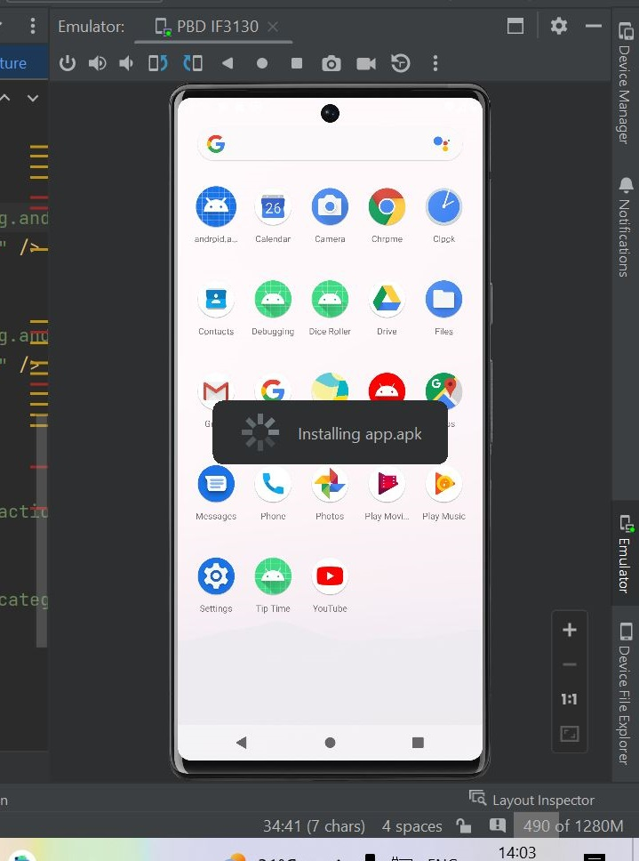
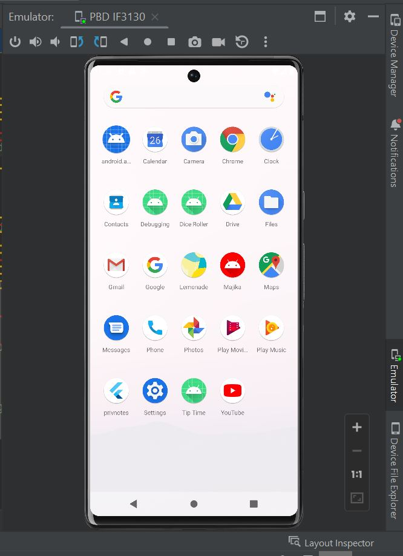
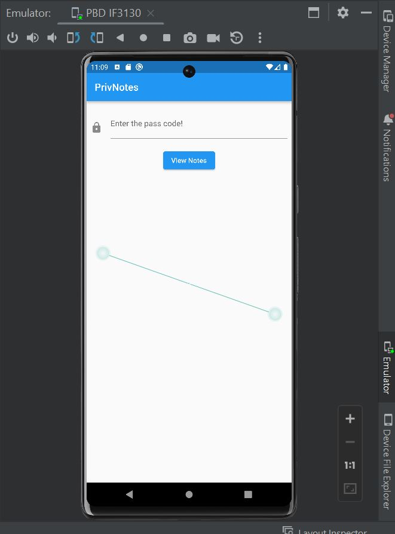
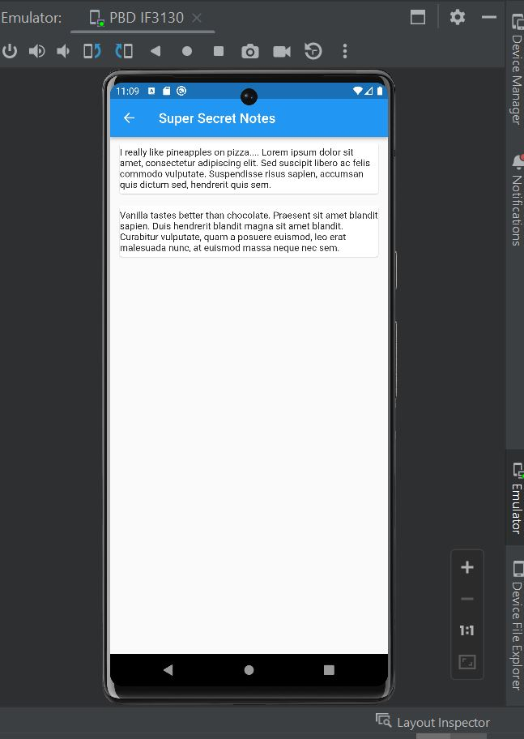

## Challenge Name: PrivNotes
>Category: Reverse Engineering

>Points: 498

>Solves: 4

### Challenge Description: 

I've been having a lot of trouble keeping my deepest secrets... so I just locked it all in my own custom made app and locked it with a secret password system as I trust no one. Wait, what's a debug mode again?

Original Author: sl0ck

Artifact Files:
* [app.apk](https://ctf.compfest.id/files/3be36906c7fa779c1c006587d9c72133/app.apk?token=eyJ1c2VyX2lkIjoxMCwidGVhbV9pZCI6bnVsbCwiZmlsZV9pZCI6MzR9.ZOlpvA.4wWvSqiCTzAtbLNL4g6W7r2clCU)


### Approach


**1. Analyze App**

Pada challenge ini kita diberi sebuah file ```apk``` yakni ```app.apk```. Dari ekstensinya sepertinya jelas ini file untuk android. Untuk mencobanya bisa dengan mengunduh di perangkat android atau via emulator. Karena ku kebetulan masih punya emulator bekas ngerjain tugas kuliah android, ku pake emulator aja. Kalau ada yang ingin pakai emulator juga, [disini](https://developer.android.com/studio/run/emulator) ada caranya.

Jika pake emulator, maka kita perlu install programnya dulu. Jika menggunakan android studio, nyalakan emulator terlebih dahulu, lalu tinggal drag and drop file ```app.apk``` ke layar emulator seperti ini:

Jika proses instalasi sudah selesai, maka akan ada aplikasi bernama ```privnotes``` di layar.


Jika ikon aplikasi ditekan, kita akan disajikan halaman berikut:  

Sepertinya tugas kita adalah memasukkan password yang tepat untuk bisa mengakses aplikasi dan mendapatkan flag. (Spoiler alert: ada twist sedikit).

**2. Decompiling APK**

Langkah selanjutnya adalah melakukan decompiling. Setelah melakukan searching, ku menemukan writeup challenge sejenis [di sini](https://dhiyaneshgeek.github.io/ctf/writeup/2021/01/20/cyber-gym-4.0-ctf-writeup/) oleh **@dhiyaneshgeek**. Dari writeup ini, ternyata file ```apk``` bisa didekompilasi dengan menggunakan [apktool](https://github.com/iBotPeaches/Apktool). Untuk menggunakan ```apktool```, tinggal unduh saja file ```jar```-nya.

Setelah diunduh, jalankan command berikut:
```
java -jar PATH_TO_APKTOOL/apktool.jar d PATH_TO_APK/app.apk
```
Diperoleh:
```
CWD\Downloads>java -jar apktool.jar d app.apk
I: Using Apktool 2.8.1 on app.apk
I: Loading resource table...
I: Decoding AndroidManifest.xml with resources...
I: Loading resource table from file: XXX\apktool\framework\1.apk
I: Regular manifest package...
I: Decoding file-resources...
I: Decoding values */* XMLs...
I: Baksmaling classes.dex...
I: Copying assets and libs...
I: Copying unknown files...
I: Copying original files...
```
Setelah ini, akan muncul sebuah folder bernama ```app``` yang berisi beberapa folder di dalamnya.

Seperti di writeup, mari kita cek apakah ada library eksternal seperti flutter atau tidak yang bisa dilihay di ```AndroidManifest.xml```.
```
.....
            <meta-data android:name="io.flutter.embedding.android.NormalTheme" android:resource="@style/NormalTheme"/>
            <meta-data android:name="io.flutter.embedding.android.SplashScreenDrawable" android:resource="@drawable/launch_background"/>

.....
```
Dari potongan ini terlihat aplikasi ini menggunakan ```flutter```, berarti kita perlu mendapatkan source code ```.dart``` nya. Kita bisa mengikuti langkah di writeup untuk mendapatkan source code nya. Jadi di aplikasi flutter, akan ada file bernama ```kernel_blob.bin``` yang berisi source code file ```.dart```. Kita bisa menggunakan command ```strings``` (yang  menariknya di windows namany sama dengan di linux), lalu hasilnya di-_redirect_ ke file ```extracted.dart``` (dan menariknya juga, output redirection di windows sintaksnya sama dengan linux). Oke tidak usah basa basi berikut command yang diperlukan:
```
strings kernel_blob.bin > extracted.dart
```
Jika kita buka file ```extracted.dart``` akan banyak string-string gak jelas disana. Karena kita tahu di aplikasi ada teks ```View Notes```. Kita cari saja bagian kode yang ada string tersebut dan salin kode yang bersesuaian. Kode yang bersesuaian sudah ku salin dan ku masukkan ke file [```PrivNotes.dart```](PrivNotes.dart) yang ada di repo ini.

**3. Analyze Code**

Di program ini ada **2** kelas utama:  
- Kelas ```UhcEpFGBRM```. Kelas ini mengatur logika untuk autentikasi login
- Kelas ```OaqqprViEU```. Kelas ini mengatur halaman secret text.

Dari kode yang ada, alur programnya adalah, ketika kita menekan ```View Notes```, fungsi ```aVPRtlcZip``` di kelas ```UhcEpFGBRM``` akan dipanggil untuk autentikasi. Jika lolos, maka kelas ```OaqqprViEU``` akan diinstantiasi dan secret notes akan ditampilkan.

Untuk fungsi ```aVPRtlcZip```, dia akan melakukan iterasi terhadap semua elemen string password berurutan, kemudian dicek apakah nilai code unit UTF-16 karakter pada indeks **i** jika dilakukan operasi ```XOR``` dengan nilai code unit karakter pada indeks **i** pada string dengan indeks ke-0 pada variabel ```eXyyDPIZKn``` di kelas ```OaqqprViEU``` (```I really like pineapples on pizza.... Lorem ipsum dolor sit amet, consectetur adipiscing elit. Sed suscipit libero ac felis commodo vulputate. Suspendisse risus sapien, accumsan quis dictum sed, hendrerit quis sem.```), lalu dilakukan operasi ```XOR``` dengan nilai code unit karakter pada indeks **i** pada string dengan indeks ke-1 pada variabel ```eXyyDPIZKn``` di kelas ```OaqqprViEU``` (```Vanilla tastes better than chocolate. Praesent sit amet blandit sapien. Duis hendrerit blandit magna sit amet blandit. Curabitur vulputate, quam a posuere euismod, leo erat malesuada nunc, at euismod massa neque nec sem.```), memiliki nilai yang sama dengan integer pada list ```HnkCQqPbEL``` di indeks **i**. Jika tidak maka verifikasi gagal. Untuk kasus karakter terakhir, dilakukan juga verifikasi apakah nilai kode unitnya **125** atau dengan kata lain merupakan karakter ```}```.

**4. Make Payload and Get the Flag**

Agar bisa mendapatkan password yang sesuai, mari kita lakukan reverse engineering fungsi ```aVPRtlcZip```. Berikut alur utamanya:
```import 'dart:math';

var HnkCQqPbEL = [
  92,
  14,
  81,
  92,
  75,
  69,
  .....
]

var eXyyDPIZKn = [
  "I really like.....
]
void main() {
  print('Start Reversing...');
  var flag = reverse();
  print("Password (and flag) :" + flag);
}

String reverse() {
  List<int> flag = [];

  var i = 0;
  while (flag.length == 0 || flag[flag.length - 1] != 125) {
    flag.add(eXyyDPIZKn[0].codeUnitAt(i) ^
        eXyyDPIZKn[1].codeUnitAt(i) ^
        HnkCQqPbEL[i]);
    i++;
  }
  return String.fromCharCodes(flag);
}
```
Karena operasi ```XOR``` bersifat komutatif, kita tinggal lakukan operasi ```XOR``` balik untuk mendapatkan input yang sesuai. Hal ini dilakukan sampai karakter input yang sesuai yang baru ditambahkan adalah **125** (```}```). Untuk menjalankannya masukkan command berikut:
```
dart pn_reverse.dart
```
Pastikan sudah meng-_install_ dart terlebih dahulu. Jika belum, ikuti petunjuk di halaman resmi [dart](https://dart.dev/get-dart).

Diperoleh hasil sebagai berikut:
```
Start Reversing...
Password (and flag) :COMPFEST14{0k_n0_m04r_d3bu6_m0d3_n3xT_ti3m__mayB_ba3e31290d}
```
Tunggu dulu...password aplikasinya adalah _flag_-nya ternyata! diluar Nayla memang. Yasudahlah, flag nya dah dapet:
```
COMPFEST14{0k_n0_m04r_d3bu6_m0d3_n3xT_ti3m__mayB_ba3e31290d}
```

**5. BONUS: The Secret Notes**

Buat yang penasaran apa isi _private notes_-nya, berikut _screenshot_-nya:


### Reflections

Latihan yang bagus untuk belajar me-_reverse_ program flutter dan ```APK``` in general. Belajar bahasa ```dart``` serta mencoba domain reverse engineering baru.
  
---
[Back to home](../Readme.md)
