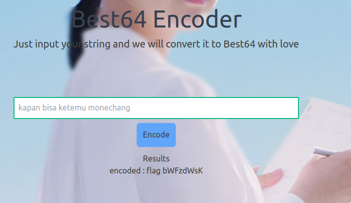
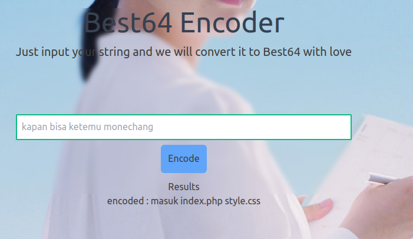
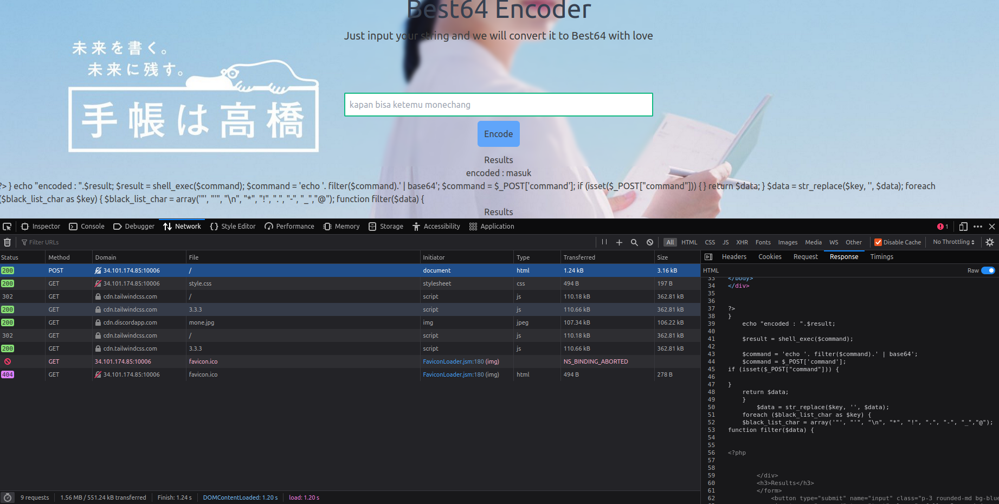
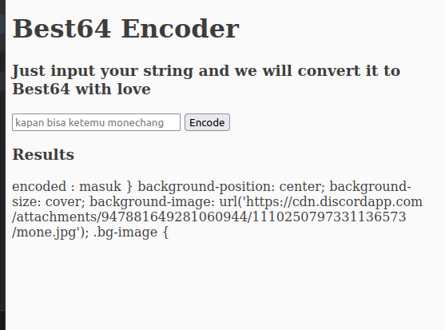
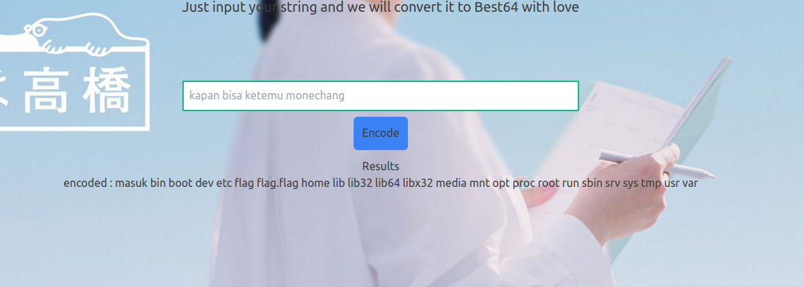
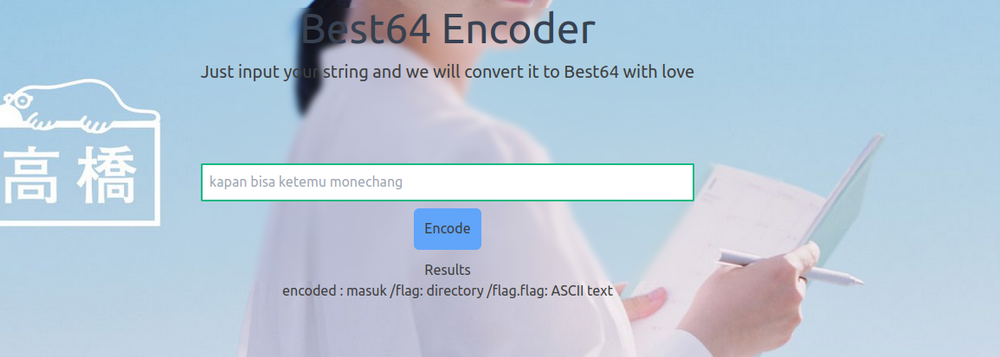
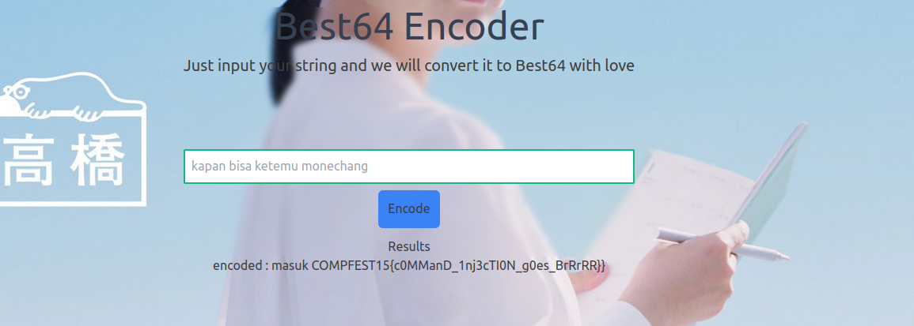

## Challenge Name: best64
>Category: Web Exploitation

>Points: 269

>Solves: 38

### Challenge Description: 


Can You? i can only tell you a little bit though
```
function filter($data) {
    $black_list_char = array('"', "'", "\n", "*", "!", ".", "-", "_","@");
    foreach ($black_list_char as $key) {
        $data = str_replace($key, '', $data);
    }
    return $data;
}
```
http://34.101.174.85:10006/


Artifact Files:
-

### Approach

**1. Analyze the Website**

Mari kita coba buka websitenya

Hanya website standar yang pakai tailwind. Jika kita input teks maka akan menghasilkan output berupa nilai Base64 dari input tersebut.


**2. Find the Exploit**

Kita coba-coba masukkan input. Misal:
```
flag
```
Hasil:

Ke-_encode_ base64 biasa ya...

Hmm coba kita iseng iseng masukin payload kali aja bisa inject kode
```
flag; echo "masuk"
```
Hasil:

Bener dong bisa kita inject command. Bentar jangan-jangan ini command nya nembak ke shell bukan ke php? Mari kita coba.
```
masuk ; ls; dummy
```
Dari behaviornya, command pertama akan ke-_echo_, command terakhir akan ke-_encode_, tapi kurang tahu kalo yang ditengah bakal gimana. Mari kita coba!

Jalan dong command yang ditengah. Terlihat disini ada 2 file yakni ```index.php``` dan ```style.css```.

**3. Get the Flag**

Sekarang kita coba lihat isi keduanya kali aja ada flag. Namun kita punya masalah.
```
function filter($data) {
    $black_list_char = array('"', "'", "\n", "*", "!", ".", "-", "_","@");
    foreach ($black_list_char as $key) {
        $data = str_replace($key, '', $data);
    }
    return $data;
}
```
Jika kita ingin lihat isinya, kita perlu memasukkan command seperti:
```
cat index.php
```
Namun, karakter ```.``` akan kena filter jadi kita perlu cari workaround.

Di bagian ini lumyan stuck sampai akhirnya ku ke discord dan nemu hint.


Thanks buat **@DimasMaulana** untuk hintnya.

Ku jadi penasaran soal wildcard di linux ada apa aja dan nemu website [ini](https://www.educba.com/linux-wildcards/), lumayan buat ilmu baru.

Selain dapat info soal wildcard, kita juga dapat info kalau command ```cat``` di-_banned_. Namun alternatifnya ada command ```ln``` dan ```tac```. Command ```ln``` berguna untuk ngebuat symling (symbolic link) sedangkan command ```tac``` itu mirip seperti command ```cat``` namun di print nye terbalik dari halaman bawah ke atas.

Dari hint ini speertinya command ```tac``` lebih berguna. Mari kita coba!
```
masuk ; tac index?php; dummy
```
Hasil:

Kita dapat html nya, namun tidak ada flag disini. Coba kalau di ```style.css```.
```
masuk ; tac style?css; dummy
```
Hasil:

Gak ada flag :sadge:

Kita ```ls``` ke direktori atas gak bakal guna karena
```
ls ??
```
Akan coba lihat isi direktori  ```??```. Tidak berguna.

Hmmm...tunggu, bagaimana kalau kita ke ```root```? berhubung karakter ```/``` gak di-_banned_.
```
masuk ; ls /; dummy
```

Nah ke list. Coba kita lihat yang menarik. 

Terlihat ada dua entri bernama ```flag``` dan ```flag.flag```. Namun kita tidak tahu ini file atau direktori. Mari kita coba cek. Sama ku penasaran, bisa chaining command gak ya?
```
masuk ; file /flag; file /flag?flag;dummy
```
Hasil:

Bisa ternyata! ```flag``` itu direktori sedangan ```flag.flag``` itu file. Mari kita coba lihat isi ```flag.flag```.
```
masuk ; tac /flag?flag;dummy
```

Alhamdulillah dapat flagnya! Flagnya adalah:
```
COMPFEST15{c0MManD_1nj3cTI0N_g0es_BrRrRR}
```

### Reflections

Permulaan menarik untuk belajar command injection di PHP, wildcard unix, serta command-command shell tidak biasa.
  

---
[Back to home](../Readme.md)
