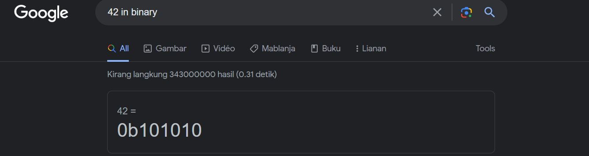

## Challenge Name: 2Warm
>Category: General

>Points: 50

>Solves: 81,301

### Challenge Description: 

Can you convert the number 42 (base 10) to binary (base 2)?

Artifact Files: -

### Approach

**1. How to get the flag?**

Kita tinggal tulis saja "42 in binary" di kolom pencarian _search engine_ seperti Google dan langsung dapat hasilnya.

Didapat _flag_-nya sebagai berikut:
```
picoCTF{101010}
```

### Reflections
Permulaan menarik untuk belajar konversi desimal ke binary dan meningkatkan kemampuan _googling_.
  
---
[Back to home](../Readme.md)
