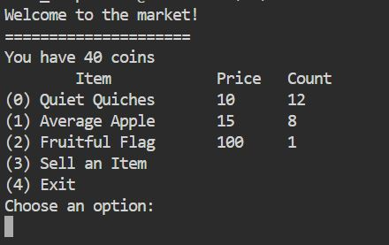
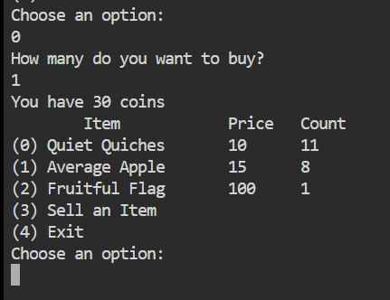
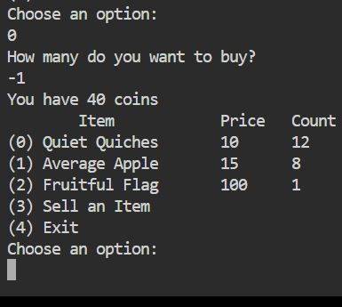
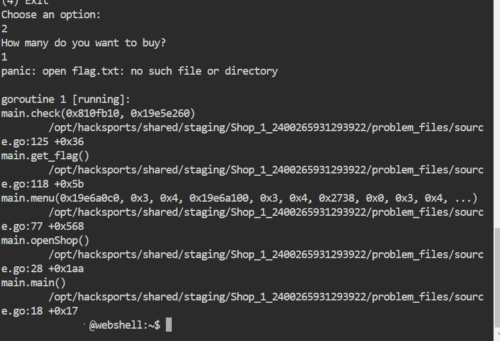
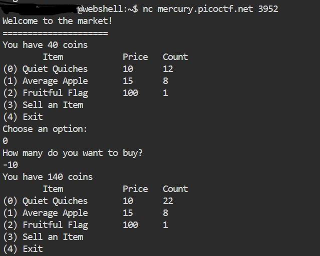
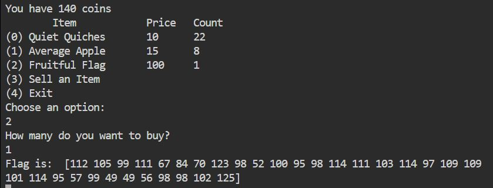

## Challenge Name: Shop
>Category: Reverse Engineering

>Points: 50

>Solves: 12,700

### Challenge Description: 

Best Stuff - Cheap Stuff, Buy Buy Buy... Store Instance: [source](https://mercury.picoctf.net/static/db20ea321ce780e69e29fd4b60e60fe0/source). The shop is open for business at ```nc mercury.picoctf.net 3952```.


Artifact Files:
* [source](https://mercury.picoctf.net/static/db20ea321ce780e69e29fd4b60e60fe0/source)

### Approach
**1. Analisis Program**  
Pertama-tama, mari kita jalankan programnya untuk tahu ini ngapain.
  
Sepertinya seperti UI aplikasi _market_ biasa. Tunggu dulu, ada _item_ bernama **Fruitful Flag**. Sepertinya ini _flag_-nya.

Masalahnya kita cuma ada 40 koin sedangkan untuk beli _flag_-nya butuh 100 koin.

**2. Eksperimen**  
Sepertinya ada mekanisme pada program yang _broken_ sehingga _somehow_ kita bisa dapat _flag_-nya meski koin kurang.

Coba kita pesan **Quiet Quiches**.  
  
Koinnya berkurang ya seperti yang diekspetasikan.

Bentar, kalau masukkin kuantitas negatif apa yang terjadi ya?
  
Wah nambah cuy koinnya. Sepertinya tidak ada validasi bahwa kuantitas harus potitif.

Kita coba mesen -1000 unit **Quiet Quiches**.  
  
Saatnya beli _flag_.
  
Wah _crash_. Tapi seperinya ini karena **flag.txt** gak ketemu (yang mana ini benar karena di _local_ gak ada **flag.txt**). Berarti kita udah di jalan yang benar dan tinggal nembak ke server.

**3. Dapatkan _Flag_**  
Kita tembak ke server untuk mendapatkan _flag_-nya. 

Selanjutnya kita beli _flag_-nya.
  
```
[112 105 99 111 67 84 70 123 98 52 100 95 98 114 111 103 114 97 109 109 101 114 95 57 99 49 49 56 98 98 102 125]
```
Wah, dikirimnya dalam bentuk larik (_array_) angka. Dari pola angkanya yang diatas 30 dan dibawah 130, sepertinya ini kode ASCII. Mari kita ubah menjadi _string_.
### Reflections
Permulaan menarik buat nyobain bahasa-bahasa aneh kayak **G-Code**. Meskipun terlihat aneh ini ternyata bahasa buat _3d modelling_ macam **Blender**. Sama _challenge_ ini berguna juga meningkatkan _skill googling_ buat nyari interpreter yang udah ada.
```python
integer_flag = [112,105,99,111,67,84,70,123,98,52,100,95,98,114,111,103,114,97,109,109,101,114,95,57,99,49,49,56,98,98,102,125]
print(''.join(list(map(lambda x: chr(x),integer_flag)))) 
```
Didapat _flag_-nya:
```
picoCTF{b4d_brogrammer_9c118bbf}
```
### Reflections
Pengalaman menarik belajar ngecek _edge case_ tanpa ngecek kode program. Menarik juga karena ternyata programnya pakai bahasa **Go** (kelihatan dari _error message_-nya).

---
[Back to home](../Readme.md)
