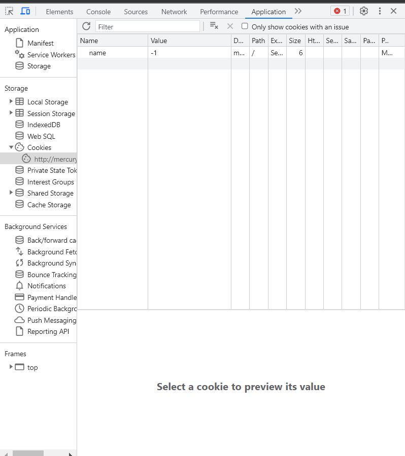

## Challenge Name: Cookies
>Category: Web Exploitation

>Points: 40

>Solves: 43k+

### Challenge Description:
 
Who doesn't love cookies? Try to figure out the best one. http://mercury.picoctf.net:6418/

Artifact Files:
-

### Approach

ngide:
1. masukin snickerdoodle
2. ubah ubah cookiesnya sampe dapet (name=18)

**1. Analisis Website**

Pertama kita lihat dulu websitenya. Hanya website HTML biasa tentang Cookies (pun intended) Searcher


**2. Analisis Cookie**
Sekarang ngapain ya? coba masuk sesuatu misal "meong"

Ternyata gak bisa ges, mari kita lihat apa yang terjadi di balik layar


Terlihat bahwa request POST ke /search men set cookie name sebesar -1. Mari kita lihat cookie yang kita punya

Hanya ada cookie name dengan value -1.

Dari nama challengenya, sepertinya kita perlu main main dengan cookies.

Pertanyaannya, apa nilai yang harus di assign?

Mari kita coba langsung ganti nilai cookie nya ke "flag"


Dan masih gagal...


**3. Mendapatkan Flag**

Sekarang apa yang harus kita input? tunggu dulu, placeholder di search bar nya tertulis snickerdoodle, bagaimana bila kita masukkan itu?

Woah..kita berhasil masuk ke halaman baru dan cookies namenya berubah dari -1 menjadi 0. 

Sekarang karena sudah di halaman baru, apa yang terjadi jika kita main main cookies

Woah keganti dong. Sekarang saatnya nguli sampai dapat flagnya.

Setelah nguli, diproleh jika name=18, maka flagnya akan muncul.


Diperoleh flagnya:
```
picoCTF{3v3ry1_l0v3s_c00k135_88acab36}
```

### Reflections
Lumayan belajar tentang main main cookies, meski awalnya sempat bingung harus ngapain dan awal awal ngubah cookie gak ngefek.

---
[Back to home](../Readme.md)
