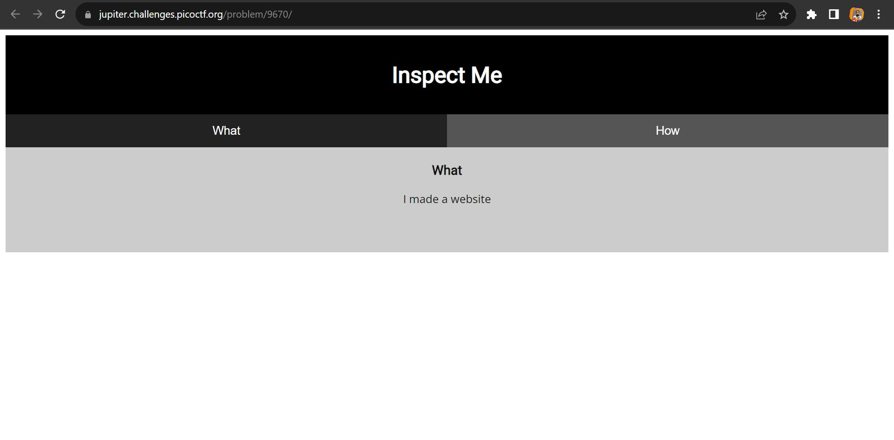
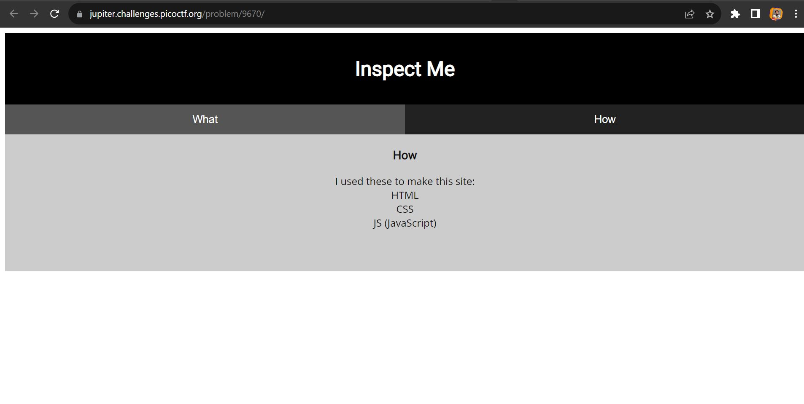
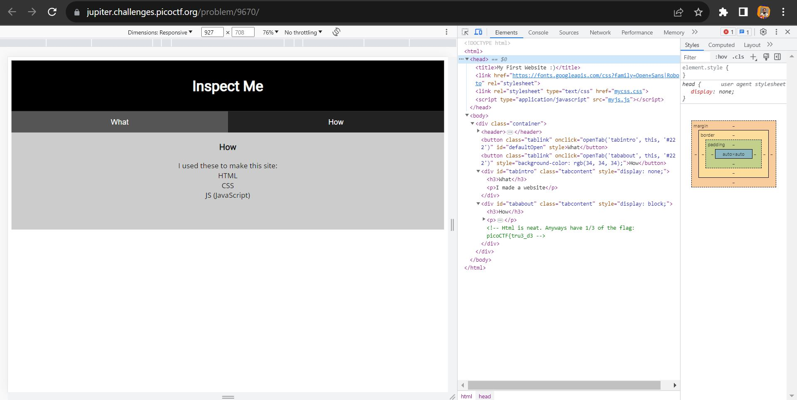
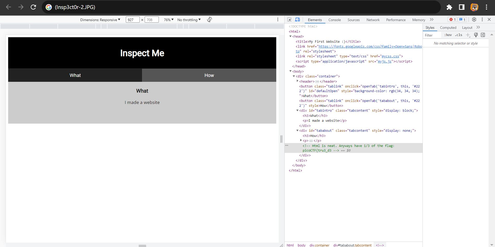
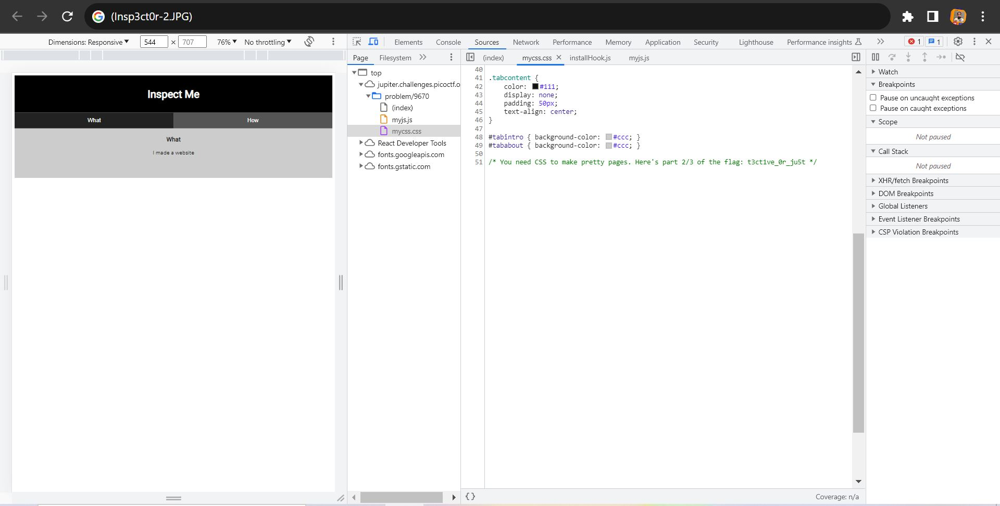
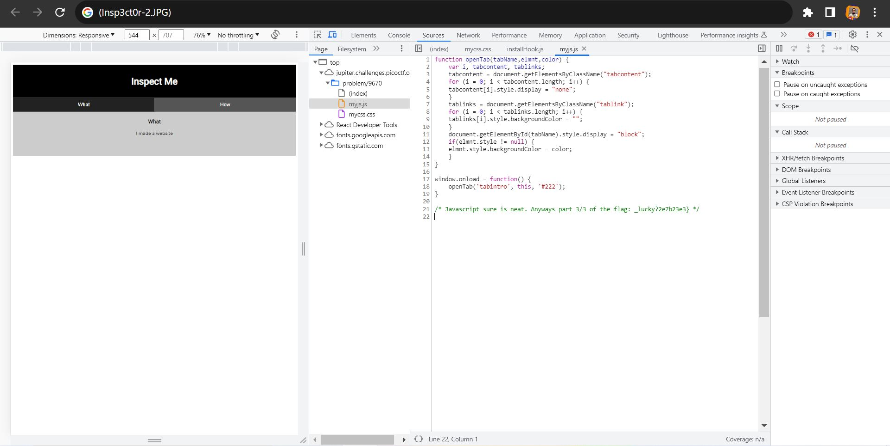

## Challenge Name: Insp3ct0r
>Category: Web Exploitation

>Points: 50

>Solves: 81k+

Challenge Description: 
Kishor Balan tipped us off that the following code may need inspection: ```https://jupiter.challenges.picoctf.org/problem/9670/``` ([link](https://jupiter.challenges.picoctf.org/problem/9670/)) or http://jupiter.challenges.picoctf.org:9670


Artifact Files:
-

### Approach

**1. Analisis Website**

Pertama kita lihat dulu websitenya. Hanya website HTML+CSS+JS standar dengan tombol untuk berganti tab yang berisi what and how dan bisa berubah ubah bila ditekan.



**2. Mendapatkan Flag**

Karena tidak ada sesuatu yang mencurigakan dan kita diminta meng-inspect sesuatu, yakni kodenya, saatnya buka inspect element yang sudah pernah disinggung caranya di writeup [ini](Inspect%20HTML.md)

Oh ternyata flagnya dipecah jadi 3 bagian saudara/i. Disini kita mendapatkan part pertama yakni:
```
picoCTF{tru3_d3
```

Saatnya mencari part berikutnya. Bagaimana bila tombol ```What``` ditekan


Sayangnya tidak ada flag baru saudara/i

Hmm..cari dimana lagi ya?

Tunggu!!! di Head terlihat bahwa website ini merefer ke file css dan js. Mari kita coba lihat file css nya terlebih dahulu dengan membuka tab console lalu pilih ```mycss.css``` dari list:

Akhirnya dapat flag bagian 2 nya yakni:
```
t3ct1ve_0r_ju5t
```

Sekarang tinggal flag terakhir. Kemungkinan besar sih di file javascriptnya.

Dan benar saja saudara, didapat potongan puzzle terakhir untuk menyelesaikan challenge ini yakni:
```
_lucky?2e7b23e3}
```

Jika kita kombinasikan semua fragmen flag tersebut, diperoleh lah flag utuhnya yakni:
```
picoCTF{tru3_d3t3ct1ve_0r_ju5t_lucky?2e7b23e3}
```

### Reflections
Lumayan menarik dimana kita diminta untuk mengecek source code dari websitenya. Serasa seperti detective euy seperti flagnya, nyari-nyari potongan clue buat dapatin flagnya.

---
[Back to home](../Readme.md)
