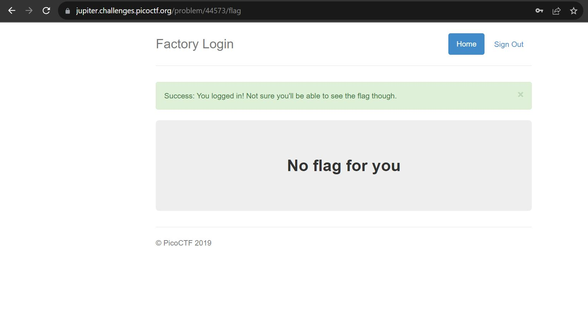

## Challenge Name: logon
>Category: Web Exploitation

>Points: 100

>Solves: 40k+

### Challenge Description:
 
The factory is hiding things from all of its users. Can you login as Joe and find what they've been looking at? ```https://jupiter.challenges.picoctf.org/problem/44573/``` ([link](https://jupiter.challenges.picoctf.org/problem/44573/)) or http://jupiter.challenges.picoctf.org:44573

Artifact Files:
-

### Approach

**1. Analisis Website**

Pertama kita lihat dulu websitenya. Hanya website Bootstrap standar dengan login form. Apakah ini soal SQL Injection?


**2. Wrong method, dudes**

Mari kita coba lakukan SQL Injection. Dari deskripsi soal kita diminta untuk login ke akun ```Joe```., tapi kita gak tahu passwordnya. Mari kita bikin payload untuk sql injection:
```
Username: Joe
Password: ' OR 1=1;--
```
Jika ini query yang tidak disanitasi, querynya akan menjadi berikut:
```
SELECT * FROM user WHERE username='Joe' AND password='' OR 1=1;--;
```
-- berguna untuk melakukan comment di SQL.
Mari kita coba serang.

Lah gagal dong. Hmm coba kalau kita inject di username juga
```
Username: Joe' OR 1=1;--
Password: ' OR 1=1;--
```
Query nya semestinya akan menjadi ini:
```
SELECT * FROM user WHERE username='Joe' OR 1=1;--' AND password='' OR 1=1;--;
```
Yep, passwordnya gak bakal dicek harusnya. Mari kita coba run

Masuk sih tapi websitenya kok kek ngejek kek gini ya:

Credits:www.kapwing.com

Aduh harus apa ya?

Coba lihat lah apa yang terjadi ketika kita login di network

Saat kita login dia melakukan setidaknya 4 kali request. Tapi request yang ini menarik karena dia ngeset 3 cookies:
1. admin = False
2. password = '' OR 1=1;--;
3. username = Joe' OR 1=1;--

Developer macam apa yang nyimpan password di cookies dah? mana gak di encrypt lagi!!?

Bentar, dia juga nyimpen status apakah dia admin atau bukan di cookies. Sekarang sih ```False```, tapi apa yang terjadi kalo kita jadiin ```True```?


Mari kita refresh

Alhamdulillah dapat flagnya!
```
picoCTF{th3_c0nsp1r4cy_l1v3s_0c98aacc}
```

### Reflections
Menarik sih. Awalnya kukira bakal SQL Injection ternyata privilege escalation pakai cookies. Pelajaran juga buat developer buat gak nyimpan data penting di cookies dah.

---
[Back to home](../Readme.md)
